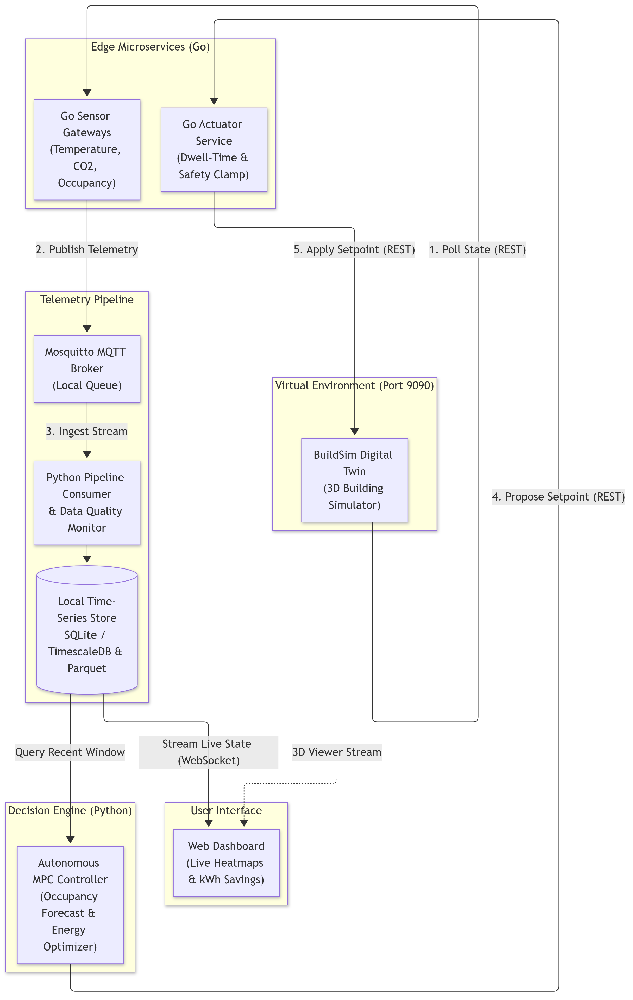
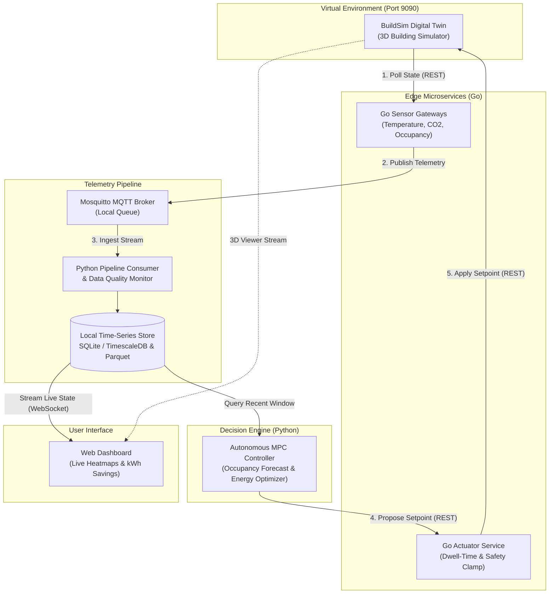

# D7065E: Project Scope Clarification & Architecture Boundary

**Project:** Smart HVAC & Climate Optimization System  
**Course:** D7065E — Embedded Intelligence at the Edge (LTU, 7.5 ECTS)  
**Document Purpose:** Clarifying system scope, debunking edge-to-cloud/ColonyOS misconceptions, and aligning team members on what is actually being built.

---

## 1. The Question from Team Members

> *"Do we need to build an edge-AI inference engine, then connect it to the cloud, and then connect it to ColonyOS?"*

### The Short Answer:
**No, absolutely not.** That is a major misconception based on optional buzzwords in the syllabus. Trying to build an edge-to-cloud pipeline with ColonyOS will overcomplicate the project, burn time on unnecessary infrastructure, and deviate from what the course actually assesses.

---

## 2. Misconception vs. Reality Matrix

| Topic | The Misconception | The Reality (Course Specification) |
| :--- | :--- | :--- |
| **Deployment Location** | *"Deploy to Cloud"* | **100% Local.** Page 1 of the Assignment Spec explicitly mandates: *"All microservices run locally on the student's machine... Execute `docker compose up` to spin up containers."* |
| **ColonyOS** | *"Must connect to ColonyOS"* | **Strictly Optional.** ColonyOS is a research orchestration framework developed at LTU. The spec states: *"Optionally leverage SOA frameworks... or ColonyOS."* The official Grade-5 reference project does **not** use ColonyOS. |
| **The "AI" Component** | *"Heavy Edge-AI Inference (Computer Vision / Deep Learning)"* | **Predictive Optimization (MPC).** The course states: *"Sophisticated AI is not required; architectural integration and reliability are key."* Our AI is a lightweight occupancy forecaster and a **Model Predictive Control (MPC)** mathematical optimizer in Python. |
| **Orchestration Tool** | *"Cloud Kubernetes or ColonyOS"* | **Docker Compose.** Standard, robust local containers managed via a single `docker-compose.yml`. |

---

## 3. What We Are ACTUALLY Building

We are building a **Local, Autonomous Cyber-Physical Smart Building Control Loop** running entirely on a laptop in Docker:

*Interactive Diagram Source:*

[🎨 Open/Edit diagram on Mermaid.ai](https://l.mermaid.ai/7wm6mb)

### Step-by-Step Flow:
1. **The Environment (BuildSim):** The university-provided 3D simulation server running on `:9090`.
2. **Edge Sensors (Go):** Read temperature, $\text{CO}_2$, and occupancy numbers from BuildSim rooms.
3. **Telemetry Pipeline (MQTT):** Local Mosquitto broker decouples sensors from the rest of the system.
4. **Data Store:** Ingests readings into a local database (SQLite / TimescaleDB) for live queries and Parquet files for history.
5. **The Autonomous "Brain" (Python):** Uses **Model Predictive Control (MPC)** to forecast room occupancy and thermal loads, then selects optimal setpoints that minimize electrical power while keeping temperature (20–24°C) and $\text{CO}_2$ (< 1000 ppm) within comfort bounds.
6. **Actuators (Go):** Applies validated setpoints back to BuildSim fans and heating units.
7. **Live Dashboard:** Web visualizer displaying live energy savings (% kWh saved vs. a fixed schedule baseline) and room heatmaps.

---

## 4. Why Did the Confusion Happen?

* **ColonyOS:** Mentioned as a single bullet point on page 3 of the assignment spec as an *example* of edge-cloud orchestration frameworks developed at LTU. It is not a project requirement.
* **"Edge Intelligence":** The course title is *"Embedded Intelligence at the Edge"*. In systems engineering, "Edge" in this context simply means your laptop acting as a building edge gateway running autonomous microservices, rather than relying on a centralized cloud server.

---

## 5. Team Alignment Message (Copy & Paste for Group Chat)

> *"Hi! Just to clarify what we are building: we do **not** need the cloud or ColonyOS. The assignment specification explicitly states that all microservices must run locally on our machines using Docker Compose.*
> 
> *ColonyOS is just an optional research tool from LTU mentioned as an example, and the course’s own Grade-5 sample project doesn't use it at all.*
> 
> *Our project is a **local closed-loop HVAC controller**: our Go sensor containers read temperature, CO2, and occupancy from BuildSim, publish to a local MQTT broker, and our Python MPC controller optimizes heating and ventilation setpoints to save energy. Everything runs 100% locally in Docker."*

