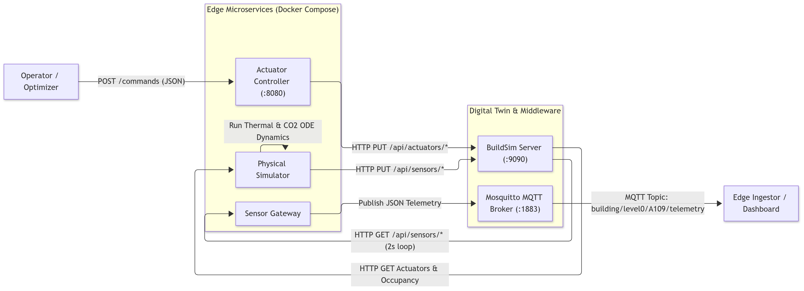
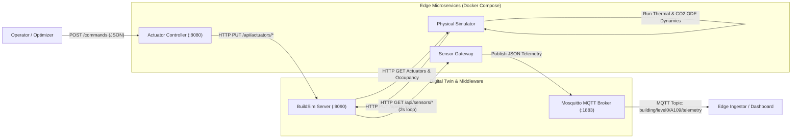

# Phase 1 (Step 02): Closing the Cyber-Physical Control Loop

**Project:** Smart HVAC & Climate Optimization System  
**Course:** D7065E — Embedded Intelligence at the Edge (LTU, 7.5 ECTS)  
**Authors:** Masooma Masooma & Team  
**Target Environment:** Windows 11 (PowerShell & Docker Desktop)  

This guide provides an exhaustive, step-by-step tutorial for implementing and deploying **Step 02 of Phase 1**: building the Cyber-Physical simulation loop, the IoT Sensor Gateway, and the Actuator Controller microservices.

---

## Architecture of the Control Loop

The following diagram illustrates how the edge microservices interact with the BuildSim digital twin and the Mosquitto MQTT broker:





[🎨 Open and Edit Diagram Online](https://mermaid.ai/app/plugin/save?state=pako%3AeNqFkkFvnDAQhf_KiEO0qRSxSS-7e6i0wIq2KoXG5NTNwWtcsGJsapustk3-e8fAViGKFN_GfG_85g1_A6YrHmyCX1IfWUONg2-3ewV4bH-oDe0a2FU1T_ijYBx-7gNfQSaY0ZYbf2lhkWj2wA3Euu3w9nIf3I8t_NnGKNoy11OnPaKc0VIivdislqvlHC4IwkVzsoJRCUS0vfSyGUNSZAhXFtul1PEjPf3_zlW1V6_sJ6IWjsryKJT3P5Uw1Bc4SVVJ7GH47JHIG4l6ISs0AQQnHRyvl-tXjrMIwUzb371wTkP2oywhMvphwK9Xq4-Xb5m7w-xQl3fcDLGEkHdOtOIP97PC1dWnJ8whJyWETLctVRWm_JXk37HbE0Y6dtnGE_m5LAso7pCmnQjpFLYNP3g6IiMdkZd0uivhvBWLOeSM9R1V7OQlxSQpzpLbXkHZcNNicBcQ5zeQJztIToq2gtk3JXNPdtjXu47mLCxuLEitu2Fqko4qkp7z6Q9S2AZ8LlByyVvuzOA_i0Y0iyZ0WEupO8E2cPBbFaoOJX_kchlur5fr0L2Ux1Jw5ez5Z_-iam7HLSXUNgdNTYVbCp7_AY24_8U&utm_source=mermaid_mcp_server&utm_medium=antigravity)

---

## Step 1: Install Go Dependencies (Eclipse Paho MQTT)

### 1. Short Description & Reasoning
* **What:** Add the official Eclipse Paho MQTT Go client library (`github.com/eclipse/paho.mqtt.golang`) to our Go module.
* **Why:** The sensor gateway must publish sensor telemetry over MQTT to the Mosquitto broker. Paho MQTT is the industry standard for MQTT in Go, supporting QoS 0/1/2, automatic reconnection, and goroutine-safe publishing.

### 2. Actual Process & Commands
Run in PowerShell:
```powershell
cd c:\university\staging
go get github.com/eclipse/paho.mqtt.golang@v1.5.1
go mod tidy
```

### 3. Code Snippet (`go.mod`)
```go
module hvac

go 1.24.0

require github.com/eclipse/paho.mqtt.golang v1.5.1

require (
	github.com/gorilla/websocket v1.5.3 // indirect
	golang.org/x/net v0.44.0 // indirect
	golang.org/x/sync v0.17.0 // indirect
)
```

### 4. Code Explanation
* `go 1.24.0`: Sets module compatibility matching the local Go toolchain.
* `require github.com/eclipse/paho.mqtt.golang v1.5.1`: Direct dependency for MQTT communication.
* `golang.org/x/net` & `golang.org/x/sync`: Required indirect networking dependencies.

---

## Step 2: Define Shared Telemetry & Actuation Models

### 1. Short Description & Reasoning
* **What:** Create a centralized data contract package in `internal/models/telemetry.go`.
* **Why:** In distributed microservices, both producers (sensor gateway, optimizer) and consumers (actuator controller, ingestor) must agree on exact JSON payloads. Centralizing this prevents schema drift and serialization bugs.

### 2. Actual Process & Commands
Create the file `internal\models\telemetry.go`:
```powershell
New-Item -ItemType Directory -Force -Path internal\models
```

### 3. Code Snippet (`internal/models/telemetry.go`)
```go
package models

import "time"

// TelemetryReading represents the JSON payload published over MQTT
type TelemetryReading struct {
	Timestamp   time.Time `json:"timestamp"`
	Building    string    `json:"building"`
	Floor       string    `json:"floor"`
	Room        string    `json:"room"`
	Temperature float64   `json:"temperature"`
	CO2         float64   `json:"co2"`
	Occupancy   int       `json:"occupancy"`
	Status      string    `json:"status"`
}

// ActuatorCommand represents an incoming command to alter room climate
type ActuatorCommand struct {
	Room     string   `json:"room"`
	Setpoint *float64 `json:"setpoint,omitempty"` // Target temperature (°C)
	Damper   *int     `json:"damper,omitempty"`   // Ventilation level (0..3)
	Reason   string   `json:"reason,omitempty"`   // Control rationale for audit logging
}

// ActuatorResponse confirms command execution
type ActuatorResponse struct {
	Success   bool      `json:"success"`
	Room      string    `json:"room"`
	Message   string    `json:"message"`
	Timestamp time.Time `json:"timestamp"`
}
```

### 4. Code Explanation
* `TelemetryReading`: Includes physical units ($^\circ\text{C}$, $\text{ppm}$, person count) and metadata (floor, room, timestamp).
* `Setpoint *float64` & `Damper *int`: Pointers allow distinguishing between "field omitted in JSON request" (`nil`) and "set to 0" (`*val == 0`).
* `Reason`: Crucial for explainability during oral defense (explaining *why* an MPC optimizer or operator changed settings).

---

## Step 3: Implement Physical Thermal & $\text{CO}_2$ Simulator

### 1. Short Description & Reasoning
* **What:** Implement a discrete ODE physics engine in `cmd/simulator/main.go` that simulates thermodynamics and $\text{CO}_2$ air dynamics for Room A109.
* **Why:** **BuildSim has NO built-in physics engine**—it is only an in-memory string store and 3D visualizer. Without this service, sensor readings would remain frozen forever. Our simulator runs a 5-second discrete Euler step calculating:
  1. **Thermal dynamics:** Newton's cooling towards outside air ($12.0^\circ\text{C}$), HVAC heating/cooling power towards setpoint, and body heat dissipation ($75\text{ W}$ per occupant).
  2. **$\text{CO}_2$ dynamics:** Metabolic exhalation ($15\text{ L/h}$ per occupant) vs. fresh air dilution modulated by the ventilation damper ($0..3$).
  3. **Room Layers Heatmap:** Writes the temperature to BuildSim's `/api/room-layers` so the 3D viewer dynamically visualizes temperature heatmaps!

### 2. Actual Process & Commands
Create the file `cmd\simulator\main.go`:
```powershell
New-Item -ItemType Directory -Force -Path cmd\simulator
```

### 3. Code Snippet (`cmd/simulator/main.go`)
```go
package main

import (
	"bytes"
	"encoding/json"
	"fmt"
	"log"
	"math"
	"net/http"
	"os"
	"strconv"
	"time"
)

type SensorPayload struct {
	ID        string `json:"id"`
	Type      string `json:"type"`
	Value     string `json:"value"`
	Timestamp string `json:"timestamp"`
}

type ActuatorResponse struct {
	ID    string `json:"id"`
	State string `json:"state"`
}

func main() {
	buildsimURL := os.Getenv("BUILDSIM_URL")
	if buildsimURL == "" {
		buildsimURL = "http://127.0.0.1:9090"
	}
	room := "A109"
	floorKey := "level0/A109"

	// Initial physical state
	currTemp := 20.5
	currCO2 := 450.0
	outsideTemp := 12.0
	outsideCO2 := 415.0

	httpClient := &http.Client{Timeout: 3 * time.Second}
	ticker := time.NewTicker(5 * time.Second)
	defer ticker.Stop()

	for range ticker.C {
		// 1. Fetch current actuator setpoint & damper
		setpoint := fetchActuator(httpClient, buildsimURL, "A109-setpoint", 21.0)
		damper := fetchActuator(httpClient, buildsimURL, "A109-damper", 1.0)

		// 2. Fetch occupancy
		occupancy := fetchOccupancy(httpClient, buildsimURL, "A109-occ")

		// 3. Euler step physics calculation (dt = 5 seconds)
		dt := 5.0
		// Newton's cooling towards outside + HVAC power + Occupancy heat
		dT_loss := -0.002 * (currTemp - outsideTemp) * dt
		dT_hvac := 0.015 * (setpoint - currTemp) * dt
		dT_occ := 0.001 * float64(occupancy) * dt
		currTemp += dT_loss + dT_hvac + dT_occ

		// CO2 generation (occupants) - dilution (damper)
		dCO2_occ := (float64(occupancy) * 2.5) * (dt / 5.0)
		ventRate := 0.01 + 0.03*damper
		dCO2_loss := -ventRate * (currCO2 - outsideCO2) * (dt / 5.0)
		currCO2 += dCO2_occ + dCO2_loss
		if currCO2 < outsideCO2 {
			currCO2 = outsideCO2
		}

		// 4. Update BuildSim Sensors
		updateSensor(httpClient, buildsimURL, "A109-temp", "temperature", fmt.Sprintf("%.1f", currTemp))
		updateSensor(httpClient, buildsimURL, "A109-co2", "co2", fmt.Sprintf("%.0f", currCO2))

		// 5. Update BuildSim 3D Room-Layer Heatmap
		updateRoomLayer(httpClient, buildsimURL, floorKey, "temperature", currTemp)
	}
}
```

### 4. Code Explanation
* `dt = 5.0`: Numerical integration timestep.
* `dT_hvac = 0.015 * (setpoint - currTemp) * dt`: Models proportional HVAC thermal transfer. As setpoint increases, heating rate is proportional to difference.
* `updateRoomLayer(...)`: Calls `PUT /api/room-layers/level0/A109` with `layer: "temperature"`. This drives the color gradient (blue=cold, green=optimal, red=hot) in the BuildSim 3D WebGL renderer!

---

## Step 4: Implement IoT Sensor Gateway

### 1. Short Description & Reasoning
* **What:** Implement the edge sensor gateway in `cmd/sensor-gateway/main.go`.
* **Why:** In IoT architectures, sensors do not talk directly to business logic or databases. The Sensor Gateway polls edge devices, aggregates sensor streams into standardized JSON envelopes, and broadcasts them over MQTT topics to decouple producers from subscribers.

### 2. Actual Process & Commands
Create the file `cmd\sensor-gateway\main.go`:
```powershell
New-Item -ItemType Directory -Force -Path cmd\sensor-gateway
```

### 3. Code Snippet (`cmd/sensor-gateway/main.go`)
```go
package main

import (
	"encoding/json"
	"fmt"
	"log"
	"net/http"
	"os"
	"strconv"
	"time"

	mqtt "github.com/eclipse/paho.mqtt.golang"
	"hvac/internal/models"
)

func main() {
	buildsimURL := os.Getenv("BUILDSIM_URL")
	mqttBroker := os.Getenv("MQTT_BROKER")
	opts := mqtt.NewClientOptions().AddBroker(mqttBroker).SetClientID("sensor-gateway-A109")
	client := mqtt.NewClient(opts)
	client.Connect().Wait()

	ticker := time.NewTicker(2 * time.Second)
	for range ticker.C {
		temp := readSensorValue(buildsimURL, "A109-temp", 20.0)
		co2 := readSensorValue(buildsimURL, "A109-co2", 400.0)
		occ := int(readSensorValue(buildsimURL, "A109-occ", 0.0))

		telemetry := models.TelemetryReading{
			Timestamp:   time.Now().UTC(),
			Building:    "A-House",
			Floor:       "level0",
			Room:        "A109",
			Temperature: temp,
			CO2:         co2,
			Occupancy:   occ,
			Status:      "ONLINE",
		}

		payload, _ := json.Marshal(telemetry)
		client.Publish("building/level0/A109/telemetry", 0, false, payload)
		client.Publish("building/level0/A109/sensor/temperature", 0, false, fmt.Sprintf("%.1f", temp))
		client.Publish("building/level0/A109/sensor/co2", 0, false, fmt.Sprintf("%.0f", co2))
	}
}
```

### 4. Code Explanation
* `time.NewTicker(2 * time.Second)`: High-frequency 2 Hz sampling for edge telemetry.
* Topics:
  - `building/level0/A109/telemetry`: Complete structured JSON bundle for database ingestors.
  - `.../sensor/temperature` & `.../co2`: Granular lightweight topics for simple IoT subscribers or Grafana alerting rules.

---

## Step 5: Implement Actuator Controller with Simplex Safety Guardrail

### 1. Short Description & Reasoning
* **What:** Implement `cmd/actuator-controller/main.go`, exposing `POST /commands` on port `8080`.
* **Why:** Provides a secure control interface for operators and future AI optimizers. **Crucially, it implements the Simplex Architecture pattern (Safety Guardrail)**: any temperature setpoint outside the safe range ($16.0^\circ\text{C} \le T \le 28.0^\circ\text{C}$) is clamped before reaching BuildSim actuators, preventing thermal runaway or freezing hazards.

### 2. Actual Process & Commands
Create the file `cmd\actuator-controller\main.go`:
```powershell
New-Item -ItemType Directory -Force -Path cmd\actuator-controller
```

### 3. Code Snippet (`cmd/actuator-controller/main.go`)
```go
package main

import (
	"bytes"
	"encoding/json"
	"fmt"
	"log"
	"net/http"
	"os"
	"time"

	"hvac/internal/models"
)

const (
	MinSafeSetpoint = 16.0
	MaxSafeSetpoint = 28.0
)

func handleCommand(w http.ResponseWriter, r *http.Request) {
	var cmd models.ActuatorCommand
	json.NewDecoder(r.Body).Decode(&cmd)

	if cmd.Setpoint != nil {
		setpoint := *cmd.Setpoint
		// Safety Guardrail Clamping
		if setpoint < MinSafeSetpoint {
			setpoint = MinSafeSetpoint
		} else if setpoint > MaxSafeSetpoint {
			setpoint = MaxSafeSetpoint
		}
		sendActuatorUpdate("A109-setpoint", fmt.Sprintf("%.1f", setpoint))
	}

	if cmd.Damper != nil {
		damper := *cmd.Damper
		if damper < 0 { damper = 0 }
		if damper > 3 { damper = 3 }
		sendActuatorUpdate("A109-damper", fmt.Sprintf("%d", damper))
	}

	json.NewEncoder(w).Encode(models.ActuatorResponse{
		Success:   true,
		Room:      cmd.Room,
		Message:   "Applied actions successfully",
		Timestamp: time.Now().UTC(),
	})
}
```

### 4. Code Explanation
* `MinSafeSetpoint = 16.0` & `MaxSafeSetpoint = 28.0`: Hard bounds protecting building equipment.
* Decouples user-facing control requests from BuildSim's raw internal REST schema.

---

## Step 6: Generic Multi-Stage Dockerfile (`Dockerfile.microservice`)

### 1. Short Description & Reasoning
* **What:** Create a single parameterized Dockerfile in `Dockerfile.microservice`.
* **Why:** Instead of maintaining three separate Dockerfiles for simulator, gateway, and controller, a single parameterized Dockerfile uses `ARG TARGET_SERVICE` to compile any Go binary directly into an empty, secure `scratch` container. Image size is minimal (~15 MB).

### 2. Actual Process & Commands
Create the file `Dockerfile.microservice`:

### 3. Code Snippet (`Dockerfile.microservice`)
```dockerfile
FROM golang:1.25-alpine AS build

WORKDIR /src
COPY go.mod go.sum ./
RUN go mod download
COPY . .

ARG TARGET_SERVICE
RUN CGO_ENABLED=0 go build -trimpath -ldflags="-s -w" -o /out/service ./cmd/${TARGET_SERVICE}

FROM scratch
COPY --from=build /out/service /service
USER 65532:65532
ENTRYPOINT ["/service"]
```

### 4. Code Explanation
* `ARG TARGET_SERVICE`: Injected by Docker Compose during build (`simulator`, `sensor-gateway`, `actuator-controller`).
* `-ldflags="-s -w"`: Strips debugging information and symbols to produce the smallest possible binary.
* `FROM scratch`: Unprivileged, zero-vulnerability base image.

---

## Step 7: Multi-Service Orchestration (`docker-compose.yml`)

### 1. Short Description & Reasoning
* **What:** Update `docker-compose.yml` to launch all 5 services with internal service discovery and networking.
* **Why:** Containers communicate using DNS names (`http://buildsim:9090`, `tcp://mosquitto:1883`) over a private bridge network without port collisions.

### 2. Actual Process & Commands
Update `docker-compose.yml`:

### 3. Code Snippet (`docker-compose.yml`)
```yaml
name: hvac

services:
  buildsim:
    build:
      context: ./buildingsim
      dockerfile: Dockerfile
    container_name: buildsim
    ports:
      - "9090:9090"
    networks:
      - hvac-net
    healthcheck:
      test: ["CMD", "/buildsim", "health", "--url", "http://127.0.0.1:9090/healthz"]
      interval: 10s
      timeout: 3s
      retries: 3

  mosquitto:
    image: eclipse-mosquitto:2
    container_name: mosquitto
    ports:
      - "1883:1883"
    volumes:
      - ./config/mosquitto.conf:/mosquitto/config/mosquitto.conf:ro
    networks:
      - hvac-net

  simulator:
    build:
      context: .
      dockerfile: Dockerfile.microservice
      args:
        TARGET_SERVICE: simulator
    container_name: physical-simulator
    depends_on:
      buildsim:
        condition: service_healthy
    environment:
      - BUILDSIM_URL=http://buildsim:9090
    networks:
      - hvac-net
    restart: unless-stopped

  sensor-gateway:
    build:
      context: .
      dockerfile: Dockerfile.microservice
      args:
        TARGET_SERVICE: sensor-gateway
    container_name: sensor-gateway
    depends_on:
      buildsim:
        condition: service_healthy
      mosquitto:
        condition: service_started
    environment:
      - BUILDSIM_URL=http://buildsim:9090
      - MQTT_BROKER=tcp://mosquitto:1883
    networks:
      - hvac-net
    restart: unless-stopped

  actuator-controller:
    build:
      context: .
      dockerfile: Dockerfile.microservice
      args:
        TARGET_SERVICE: actuator-controller
    container_name: actuator-controller
    ports:
      - "8080:8080"
    depends_on:
      buildsim:
        condition: service_healthy
    environment:
      - BUILDSIM_URL=http://buildsim:9090
    networks:
      - hvac-net
    restart: unless-stopped

networks:
  hvac-net:
    driver: bridge
```

---

## Step 8: Build, Seed & Verify the Closed Loop

### 1. Short Description & Reasoning
* **What:** Build and run the entire cluster, re-seed Room A109 equipment in BuildSim, and test actuation commands and telemetry streams.
* **Why:** Validates that the entire cyber-physical loop is operational: Actuation command $\to$ Actuator state updated $\to$ Physics simulator reacts $\to$ Temperature climbs $\to$ Gateway publishes new reading to MQTT.

### 2. Actual Process & Commands

#### 2.1 Build and launch all 5 containers
```powershell
docker compose up -d --build
```

#### 2.2 Re-seed equipment into BuildSim (in-memory state)
```powershell
go run .\scripts\seed_a109.go
```

#### 2.3 Verify all 5 containers are running
```powershell
docker compose ps
```
*Expected Output:*
```
NAME                  IMAGE                      STATUS
actuator-controller   hvac-actuator-controller   Up (healthy) 0.0.0.0:8080->8080/tcp
buildsim              hvac-buildsim              Up (healthy) 0.0.0.0:9090->9090/tcp
mosquitto             eclipse-mosquitto:2        Up 0.0.0.0:1883->1883/tcp
physical-simulator    hvac-simulator             Up
sensor-gateway        hvac-sensor-gateway        Up
```

#### 2.4 Send an actuation setpoint change to 26.0°C
```powershell
curl.exe -X POST http://localhost:8080/commands -H "Content-Type: application/json" -d '{\"room\":\"A109\",\"setpoint\":26.0}'
```
*Expected Output:*
```json
{"success":true,"room":"A109","message":"Applied actions for Room A109: Setpoint=26.0°C","timestamp":"..."}
```

#### 2.5 Observe physical simulator dynamic temperature rise
```powershell
docker compose logs --tail=10 simulator
```
*Observed Logs:*
```
[Simulator] Room A109 | Temp: 20.1°C (Target: 21.0°C) | CO2: 429 ppm (Damper: 1)
[Simulator] Room A109 | Temp: 21.0°C (Target: 26.0°C) | CO2: 428 ppm (Damper: 1)
[Simulator] Room A109 | Temp: 21.7°C (Target: 26.0°C) | CO2: 427 ppm (Damper: 1)
[Simulator] Room A109 | Temp: 22.3°C (Target: 26.0°C) | CO2: 426 ppm (Damper: 1)
```

#### 2.6 Observe real-time MQTT telemetry publishing
```powershell
docker compose logs --tail=10 sensor-gateway
```
*Observed Logs:*
```
[SensorGateway] Telemetry published -> Room A109: Temp=21.0°C | CO2=428 ppm | Occ=0
[SensorGateway] Telemetry published -> Room A109: Temp=21.6°C | CO2=427 ppm | Occ=0
[SensorGateway] Telemetry published -> Room A109: Temp=22.3°C | CO2=426 ppm | Occ=0
```

#### 2.7 Test Safety Guardrail Clamping (35°C setpoint request)
```powershell
curl.exe -X POST http://localhost:8080/commands -H "Content-Type: application/json" -d '{\"room\":\"A109\",\"setpoint\":35.0}'
```
*Observed Response:*
```json
{"success":true,"room":"A109","message":"Applied actions for Room A109: Setpoint=28.0°C","timestamp":"..."}
```
*Notice:* The 35.0°C command was automatically clamped to the safety threshold of 28.0°C!

