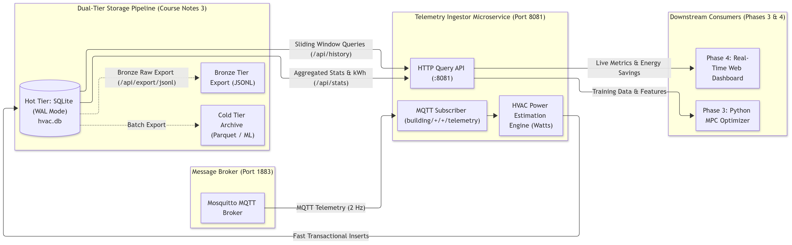
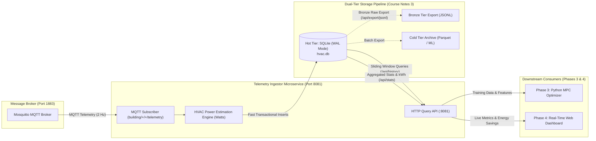

# Phase 2: Edge Telemetry Ingestion, Power Analytics & Dual-Tier Storage Pipeline

**Project:** Smart HVAC & Climate Optimization System  
**Course:** D7065E — Embedded Intelligence at the Edge (LTU, 7.5 ECTS)  
**Authors:** Masooma Masooma & Team  
**Target Environment:** Windows 11 (PowerShell & Docker Desktop)  

This guide provides an exhaustive, step-by-step tutorial for implementing **Phase 2**: building the edge MQTT Telemetry Ingestor, the real-time HVAC power calculation engine, and the edge-optimized time-series storage pipeline.

---

## Academic & Course Alignment

In **Course Notes 3** (*"Choose storage from the required questions"*), the course staff outline the recommended storage tiers for edge systems:
* **Bronze Tier (Raw Stream):** Append-only JSON Lines (JSONL) with stable identifiers to inspect and replay raw experiment records.
* **Hot Tier (Live Storage):** High-speed transactional time-series store (SQLite in WAL mode) for repeated live time-range sliding-window queries queried by the MPC optimizer.
* **Cold Tier (Columnar Lake):** Partitioned Apache Parquet files for offline model training and baseline energy analytics (fulfilling the approved proposal).

---

## Phase 2 Architecture

The following diagram illustrates how the Telemetry Ingestor consumes MQTT packets, calculates electrical power draw, writes to the persistent SQLite hot store, and exposes query APIs for Phase 3 (MPC Optimizer) and Phase 4 (Dashboard):





* **[🎨 Open / Edit Diagram Online](https://mermaid.ai/app/plugin/save?state=pako%3AeNp9U11P20AQ_CsrP1RGFaQUHqKoQsoXgioGg6PmgfThbG_tK85duDsnTUr_e3fPJpAUNXm57O3czM5OfgeZzjHoBT8qvc5KYRxM7ucK6GPrtDBiWcI4L3Bg9CMaeJgHEVorCoS2EsaaMKfd7tnRPPjeIPkTDbhX26daOqchuptOW8iuDVU-Vwdc16pA67RJ0Kxkhkw4xQoX6MxmdwmRzIy2bUujoPupe7qvIKlTlsDEdLSZkSnrTWtZ5VIVnY_0dS9v70PjtSHo1bf-EGK9JtTYOrkQTmoFY1VIRawz4Zzdh_Xja4ZNpzHc1UiCqQBhb1_ae1NfaTfUVZ7QbGwtPTKqRXU8lUT9UozlEivPPNS1sQg32qGFA9tHg4eQJGgHDO5BcjeRjtX2JxDRpo--pKZzUa5EdpKn8-DoDZS2o7ZI3M3BPwDjX0t2N_ya3N5MDkwS5qlGRwDW3rT3TVbKFe-kuYQORJP_zz7UytYLNNaPrdfKOoNi8aYexqWwPCp8gPODlMVDQvl7OOtBvHElrYiqcLukjcntm7h5e4Qtd4DzHtyjt3mBMMPU36ZamPw9wdEAjo8vnttEvYYy_AxXW1L1zClrWunAvRyjpkCHFnwpLK3GCGVFxnESFaWakuwsvzAaNP2jF66kkpxVmEmV67VPlSQnwo5Yyk4p-c-w8dyUtANovygMFsJhThESzpJ5j7OyhVqu7AM5qw2S5EnFrCPhBMEuUbjaoFdI1h62T3jhEXkhMyYZKzTFBhKxoieaqcjWV3EnHtRm7F6sdxHzwtD_6Py0WlVeX9P4D1y4rGyR3NXGLfjzF8dggkk&utm_source=mermaid_mcp_server&utm_medium=antigravity)**

---

## Step 1: Install Pure-Go SQLite Driver (`modernc.org/sqlite`)

### 1. Short Description & Reasoning
* **What:** Add the `modernc.org/sqlite` package to `go.mod`.
* **Why:** Standard SQLite Go drivers (`mattn/go-sqlite3`) rely on CGO and an external C compiler (`gcc`). In our edge microservice architecture, we build into ultra-minimal, unprivileged `scratch` Docker containers using `CGO_ENABLED=0`. `modernc.org/sqlite` is 100% pure Go translated from the SQLite C engine, allowing fast compilation without CGO while retaining standard SQLite performance.

### 2. Actual Process & Commands
Run in PowerShell:
```powershell
cd c:\university\staging
go get modernc.org/sqlite@latest
go mod tidy
```

### 3. Code Snippet (`go.mod`)
```go
module hvac

go 1.25.0

require (
	github.com/eclipse/paho.mqtt.golang v1.5.1
	modernc.org/sqlite v1.59.0
)
```

---

## Step 2: Define Consolidated Room Telemetry Snapshot Contract

### 1. Short Description & Reasoning
* **What:** Update `internal/models/telemetry.go` to add `RoomTelemetrySnapshot`.
* **Why:** The sensor gateway publishes individual sensors as well as a bundle array. For efficient relational and time-series querying, each row in our time-series database should represent the unified physical state of a room at that exact second ($T, \text{CO}_2, \text{Occupants}, \text{Power}$).

### 2. Actual Process & Commands
Modify `internal/models/telemetry.go`:

### 3. Code Snippet (`internal/models/telemetry.go`)
```go
package models

import "time"

// RoomTelemetrySnapshot represents the consolidated multi-sensor state of a room
type RoomTelemetrySnapshot struct {
	ID          int64     `json:"id,omitempty"`
	Timestamp   time.Time `json:"timestamp"`
	Level       string    `json:"level"`
	Room        string    `json:"room"`
	Temperature float64   `json:"temperature"`
	CO2         float64   `json:"co2"`
	Occupancy   int       `json:"occupancy"`
	PowerW      float64   `json:"power_w"`
}
```

---

## Step 3: Implement SQLite Storage Engine with WAL Mode

### 1. Short Description & Reasoning
* **What:** Create `internal/storage/sqlite.go` managing database connections, schema migrations, and queries.
* **Why:** Traditional databases lock the entire database file during writes. By configuring **Write-Ahead Logging (WAL)** via `PRAGMA journal_mode = WAL;`, readers (the HTTP query API) and the writer (the MQTT ingestor) never block each other. We also add compound indexes on `(room, timestamp DESC)` to guarantee sub-millisecond sliding window queries.

### 2. Actual Process & Commands
Create `internal/storage/sqlite.go`:

### 3. Code Snippet (`internal/storage/sqlite.go`)
```go
package storage

import (
	"database/sql"
	"fmt"
	"log"
	"os"
	"path/filepath"
	"time"

	_ "modernc.org/sqlite"
	"hvac/internal/models"
)

type SQLiteStore struct {
	db *sql.DB
}

func NewSQLiteStore(dbPath string) (*SQLiteStore, error) {
	dir := filepath.Dir(dbPath)
	os.MkdirAll(dir, 0755)

	db, err := sql.Open("sqlite", dbPath)
	if err != nil {
		return nil, err
	}

	db.SetMaxOpenConns(1)
	db.SetMaxIdleConns(1)

	// Enable WAL Mode & Concurrency PRAGMAs
	pragmas := []string{
		"PRAGMA journal_mode = WAL;",
		"PRAGMA synchronous = NORMAL;",
		"PRAGMA busy_timeout = 5000;",
		"PRAGMA foreign_keys = ON;",
	}
	for _, p := range pragmas {
		db.Exec(p)
	}

	schema := `
	CREATE TABLE IF NOT EXISTS telemetry (
		id INTEGER PRIMARY KEY AUTOINCREMENT,
		timestamp DATETIME NOT NULL,
		level TEXT NOT NULL,
		room TEXT NOT NULL,
		temperature REAL NOT NULL,
		co2 REAL NOT NULL,
		occupancy INTEGER NOT NULL,
		power_w REAL NOT NULL
	);

	CREATE INDEX IF NOT EXISTS idx_telemetry_room_ts ON telemetry(room, timestamp DESC);
	`
	db.Exec(schema)

	return &SQLiteStore{db: db}, nil
}

func (s *SQLiteStore) InsertSnapshot(r *models.RoomTelemetrySnapshot) error {
	query := `INSERT INTO telemetry (timestamp, level, room, temperature, co2, occupancy, power_w) VALUES (?, ?, ?, ?, ?, ?, ?);`
	ts := r.Timestamp.UTC().Format(time.RFC3339)
	res, err := s.db.Exec(query, ts, r.Level, r.Room, r.Temperature, r.CO2, r.Occupancy, r.PowerW)
	if err == nil {
		r.ID, _ = res.LastInsertId()
	}
	return err
}

func (s *SQLiteStore) GetRecentTelemetry(room string, minutes int) ([]models.RoomTelemetrySnapshot, error) {
	cutoff := time.Now().UTC().Add(-time.Duration(minutes) * time.Minute).Format(time.RFC3339)
	query := `SELECT id, timestamp, level, room, temperature, co2, occupancy, power_w FROM telemetry WHERE room = ? AND timestamp >= ? ORDER BY timestamp ASC;`
	rows, err := s.db.Query(query, room, cutoff)
	if err != nil {
		return nil, err
	}
	defer rows.Close()

	var records []models.RoomTelemetrySnapshot
	for rows.Next() {
		var rec models.RoomTelemetrySnapshot
		var tsStr string
		rows.Scan(&rec.ID, &tsStr, &rec.Level, &rec.Room, &rec.Temperature, &rec.CO2, &rec.Occupancy, &rec.PowerW)
		rec.Timestamp, _ = time.Parse(time.RFC3339, tsStr)
		records = append(records, rec)
	}
	return records, nil
}
```

### 4. Code Explanation
* `PRAGMA journal_mode = WAL`: Allows concurrent reads while writes are occurring without database locks.
* `CREATE INDEX idx_telemetry_room_ts`: Makes sliding-window queries like "fetch last 15 minutes of Room A109" $O(\log N)$ instead of doing a full table scan.

---

## Step 4: Implement Ingestor Microservice & Power Engine

### 1. Short Description & Reasoning
* **What:** Implement `cmd/ingestor/main.go` which subscribes to Mosquitto MQTT, estimates instantaneous HVAC power consumption, inserts rows into SQLite, and hosts an HTTP REST Query API.
* **Why:** To evaluate our Smart AI controller in Phase 3, we need an exact measure of electrical energy consumed ($\text{kWh}$). The Ingestor models physical electrical power:
  $$P_{\text{total}} = P_{\text{standby}} (25\text{ W}) + P_{\text{fan}}(\text{damper} \times 45\text{ W}) + P_{\text{thermal}}(350\text{ W} \times \max(0, T_{\text{setpoint}} - T_{\text{room}}))$$
  Furthermore, its HTTP API allows Python scripts in Phase 3 to fetch historical sliding windows with simple `requests.get("http://localhost:8081/api/history")`.

### 2. Actual Process & Commands
Create `cmd/ingestor/main.go`:

### 3. Key Endpoints Implemented
* `GET /healthz`: Health check returning `{"status":"UP"}`.
* `GET /api/history?room=A109&minutes=30`: Returns JSON array of recent time-series observations.
* `GET /api/stats?room=A109`: Returns aggregated analytics (min/max/avg temperature, $\text{CO}_2$, and cumulative $\text{kWh}$ energy consumed).
* `GET /api/export/jsonl?room=A109`: Streams Bronze-tier append-only JSONL format for raw archival (Course Notes 3).

---

## Step 5: Docker Containerization & Volume Persistence

### 1. Short Description & Reasoning
* **What:** Add the `ingestor` service to `docker-compose.yml` and bind-mount `./data/db:/data/db`.
* **Why:** Container filesystems are ephemeral (erased when containers stop). Mounting `./data/db` to the Windows host machine guarantees that all historical temperature and energy records persist permanently on disk.

### 2. Code Snippet (`docker-compose.yml`)
```yaml
  ingestor:
    build:
      context: .
      dockerfile: Dockerfile.microservice
      args:
        TARGET_SERVICE: ingestor
    container_name: telemetry-ingestor
    ports:
      - "8081:8081"
    environment:
      - MQTT_BROKER=tcp://mosquitto:1883
      - DB_PATH=/data/db/hvac.db
      - PORT=8081
      - BUILDSIM_URL=http://buildsim:9090
    volumes:
      - ./data/db:/data/db
    restart: unless-stopped
    depends_on:
      - mosquitto
    networks:
      - hvac-network
```

---

## Step 6: Deploy & Verify the Pipeline

### 1. Build and Run Cluster
```powershell
docker compose up -d --build
```

### 2. Verify all 6 Containers are Running
```powershell
docker compose ps
```
*Expected Output:*
```
NAME                  STATUS                    PORTS
actuator-controller   Up                        0.0.0.0:8080->8080/tcp
buildsim              Up (healthy)              0.0.0.0:9090->9090/tcp
mosquitto             Up                        0.0.0.0:1883->1883/tcp
physical-simulator    Up                        
sensor-gateway        Up                        
telemetry-ingestor    Up                        0.0.0.0:8081->8081/tcp
```

### 3. Check Live Ingestor Persistence Logs
```powershell
docker compose logs --tail=10 ingestor
```
*Observed Output:*
```
[SQLiteStore] Database initialized successfully at /data/db/hvac.db (WAL mode active)
[Ingestor] Subscribed successfully to: building/+/+/telemetry
[Ingestor] Persisted level0/A109 -> Temp=20.9°C | CO2=441 ppm | Occ=0 | Power=105.0 W
[Ingestor] Persisted level0/A109 -> Temp=21.0°C | CO2=436 ppm | Occ=0 | Power=70.0 W
```

### 4. Query Room Analytics & Cumulative Energy
```powershell
curl.exe -s http://localhost:8081/api/stats?room=A109
```
*Sample JSON Response:*
```json
{
  "room": "A109",
  "samples_recorded": 24,
  "temperature": {
    "avg": 20.94,
    "min": 20.60,
    "max": 21.20
  },
  "co2": {
    "avg": 438.1,
    "min": 431.0,
    "max": 448.0
  },
  "power": {
    "avg_watts": 107.1,
    "total_energy_kwh": 0.00101
  }
}
```

### 5. Query Time-Series Sliding Window
```powershell
curl.exe -s "http://localhost:8081/api/history?room=A109&minutes=2"
```

### 6. Verify Bronze-Tier JSONL Streaming Export
```powershell
curl.exe -s "http://localhost:8081/api/export/jsonl?room=A109" | Select-Object -First 3
```
*Output:*
```json
{"id":1,"timestamp":"2026-09-22T15:55:57Z","level":"level0","room":"A109","temperature":20.6,"co2":448,"occupancy":0,"power_w":210.0}
{"id":2,"timestamp":"2026-09-22T15:55:59Z","level":"level0","room":"A109","temperature":20.6,"co2":447,"occupancy":0,"power_w":210.0}
{"id":3,"timestamp":"2026-09-22T15:56:01Z","level":"level0","room":"A109","temperature":20.7,"co2":445,"occupancy":0,"power_w":175.0}
```

### 7. Confirm Host Persistence
In PowerShell on your Windows machine, run:
```powershell
Get-ChildItem .\data\db
```
You will see `hvac.db`, `hvac.db-shm`, and `hvac.db-wal` actively recording on your local hard drive!

