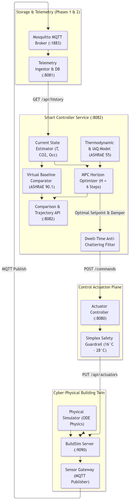
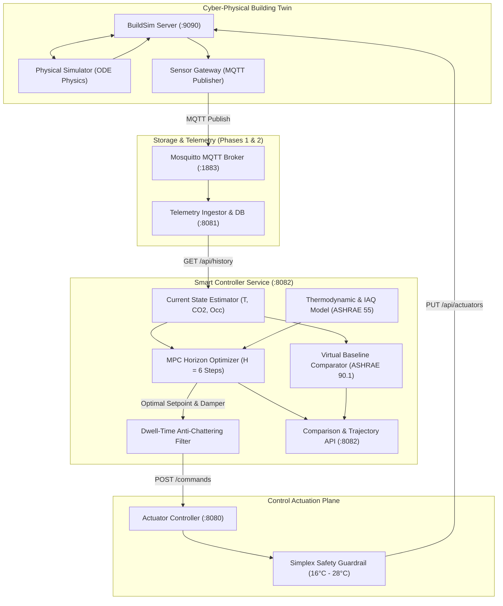

# Phase 3: Smart AI/MPC Controller vs. Fixed-Schedule Baseline

**Project:** Smart HVAC & Climate Optimization System  
**Course:** D7065E — Embedded Intelligence at the Edge (LTU, 7.5 ECTS)  
**Authors:** Masooma Masooma & Team  
**Target Environment:** Windows 11 (PowerShell & Docker Desktop)  

This guide provides an exhaustive, step-by-step tutorial for implementing and deploying **Phase 3**: the autonomous **Model Predictive Control (MPC)** optimizer, the **anti-chattering dwell-time safety filter**, the **fixed-schedule commercial baseline comparator**, and the real-time **energy benchmarking API**.

---

## Academic & Course Alignment

In **Course Notes 4** (*"Autonomous Controllers & Runtime Safety"*), the course requirements emphasize:
* **Multi-Objective Optimization:** Balancing conflicting objectives—minimizing electrical energy ($\text{kWh}$) while maintaining thermal comfort ($20\text{--}24^\circ\text{C}$ per ASHRAE 55) and healthy indoor air quality ($\text{CO}_2 < 1000\text{ ppm}$ per Swedish regulation AFS 2020:1).
* **Actuator Longevity (Anti-Chattering):** Optimizers must not oscillate rapidly between discrete action states. Enforcing **dwell-time constraints** prevents physical valve and compressor wear.
* **Empirical Benchmarking:** Quantifying energy savings ($\%$) against a traditional commercial fixed-schedule baseline under identical physical conditions.

---

## Phase 3 Architecture

The following diagram illustrates how the Smart Controller interacts with the telemetry pipeline, solves the receding horizon optimization problem, and dispatches actions to the physical actuators:





* **[🎨 Open / Edit Diagram Online](https://mermaid.ai/app/plugin/save?state=pako%3AeNp9VNty0zAQ_ZUdPzBlpqFJmXbSDjBjOyHNQyYuMrwQHlRHTQSyZGS5waX8E9_Al7EruReHDnmxVtqze7TnKD-jwqxFdB5dK7Mrttw6yCcrDfirm6uN5dUWpvpGWqNLoR18XkVpeyXsINu2tSy4gqSRai31BvKd1KvoSwDTL2GY7Y-ZLIEJeyMsHJyfDc-GL3uJGSU-FMTkRnFnMHc5mULYr_sINkMEE7rGrBl3YsdbOFhc5jlkzZWS9VbYR4DQ65Xeu9OEO57JSiipBV2KYT--EfACcqFEKZzFgtmW16KGEe4e9_svEsQsTP29kc4Z8J0Ta775C47G49f99HyO6Y-F53ojarrgC5gkCBgPx6P_02UlKrPIUk-V1pAa7axRCjvSZGUhQqE9oszhdEi0xlrSz8cwrZ0sw4jzQ0iXx4ewLIo-ctJqIo2TLM261byUBfKdx5ewQMcoOIjZxYd4Cicne6PJUpoNcr0wVt4aDcsKu8lbms0FvIVTJCGqPUEnO6EU4vx3kMtSQKydHKRb7pyw5K_3UuGq7zDUB0GfpHUNWRFDL2hqyorbcMGO5tnw1ajfkpLijJQJ6bJGrqi_5V9FgdAW8PSfoT6nTlxgeyeNzhQPdurUeTwBf9TrH9OcQgLyfKKnb7n3RFLFy4rEl2WlxA9g_Fq4FmYNt2vLJcoxOv3zO4UBHI_x-yzfhMGbweAdPrcQZwwoTNjDMYVsFkI2o_AOpXzyrFbRHXo_JCwSn5_PQ5jPu_zZNIcjXsmjrSSTt4TxtuvqegcSEj0SttBq_Q1yTyjmvUN_CsJVRqKB8cngJMgHd8E0XQladphsyZBBYcqS63VNiXFXN_ZlwzDDjl_e4z52xHknisfSePaZk9F6TO_N1E0Sj5_uRr_-AqEhoTc&utm_source=mermaid_mcp_server&utm_medium=antigravity)**

---

## Step 1: Scaffolding the Python Microservice & Dependencies

### 1. Short Description & Reasoning
* **What:** Create the `services/smart-controller` directory structure and define Python dependencies in `requirements.txt`.
* **Why:** Python is the premier language for scientific computing, dynamic simulation, and optimization. We use `FastAPI` for asynchronous API serving, `requests` for inter-service HTTP communication, and `numpy` for vector operations.

### 2. Actual Process & Commands
Run in PowerShell:
```powershell
New-Item -ItemType Directory -Force -Path .\services\smart-controller\models, .\services\smart-controller\controller, .\services\smart-controller\comparator
```

### 3. Code Snippet (`services/smart-controller/requirements.txt`)
```text
fastapi>=0.115.0
uvicorn>=0.31.0
requests>=2.32.3
numpy>=2.0.0
pydantic>=2.9.0
```

---

## Step 2: Formulating Forward Dynamics & IAQ Models

### 1. Short Description & Reasoning
* **What:** Implement `services/smart-controller/models/dynamics.py`.
* **Why:** Model Predictive Control requires an internal forward prediction model to simulate "what-if" scenarios over the future horizon. This file models:
  1. **Thermal state transition:** Convective heat loss to outside ($12^\circ\text{C}$), radiator heating lift, and metabolic heat gains ($75\text{ W}$ per occupant).
  2. **$\text{CO}_2$ air dilution:** Exhalation ($15\text{ L/h}$ per person) vs. damper-controlled mechanical ventilation ($1\%$ to $7\%$ air exchange).
  3. **Electrical power draw:** Base standby ($25\text{ W}$) + fan electrical power ($45\text{ W}$ per damper level) + proportional heating power ($350\text{ W}/^\circ\text{C}$).
  4. **ASHRAE 55 Comfort Bounds:** $20.0^\circ\text{C} \le T \le 24.0^\circ\text{C}$ and $\text{CO}_2 \le 1000\text{ ppm}$.

### 2. Code Snippet (`services/smart-controller/models/dynamics.py`)
```python
from typing import Tuple

class BuildingDynamics:
    def __init__(self, ambient_temp: float = 12.0, ambient_co2: float = 420.0):
        self.ambient_temp = ambient_temp
        self.ambient_co2 = ambient_co2

    def step(self, temp: float, co2: float, setpoint: float, damper: int, occupancy: int, dt_seconds: float = 60.0) -> Tuple[float, float, float]:
        sub_steps = max(1, int(dt_seconds / 5.0))
        sub_dt = dt_seconds / sub_steps
        curr_t = temp
        curr_c = co2

        for _ in range(sub_steps):
            # Thermal ODE
            d_t = (0.04 * (setpoint - curr_t) + 0.005 * (self.ambient_temp - curr_t) + 0.03 * float(occupancy)) * (sub_dt / 5.0)
            curr_t += d_t

            # CO2 ODE
            vent_rate = 0.01 + (0.02 * float(damper))
            d_co2_gen = 1.5 * float(occupancy) * (sub_dt / 5.0)
            d_co2_vent = vent_rate * (curr_c - self.ambient_co2) * (sub_dt / 5.0)
            curr_c += (d_co2_gen - d_co2_vent)
            if curr_c < self.ambient_co2:
                curr_c = self.ambient_co2

        # Power draw (Watts)
        base_power = 25.0
        fan_power = float(damper) * 45.0
        heating_power = max(0.0, min(2500.0, (setpoint - curr_t) * 350.0))
        power_w = base_power + fan_power + heating_power

        return curr_t, curr_c, power_w

    def comfort_penalty(self, temp: float, co2: float) -> Tuple[float, float]:
        temp_pen = 0.0
        if temp < 20.0: temp_pen = (20.0 - temp) ** 2
        elif temp > 24.0: temp_pen = (temp - 24.0) ** 2

        co2_pen = 0.0
        if co2 > 1000.0: co2_pen = ((co2 - 1000.0) / 100.0) ** 2

        return temp_pen, co2_pen
```

---

## Step 3: Fixed-Schedule Baseline Controller (ASHRAE 90.1 Benchmark)

### 1. Short Description & Reasoning
* **What:** Implement `services/smart-controller/comparator/baseline.py`.
* **Why:** In empirical research, a smart system can only be proven effective if measured against a realistic industrial baseline. We implement standard commercial timer control:
  * **Working Hours (Mon–Fri 08:00–17:00):** Constant Setpoint $22.0^\circ\text{C}$, Damper Level 2.
  * **Off-Hours & Weekends:** Night setback $16.0^\circ\text{C}$, Damper Level 0.
* Runs in parallel under identical weather and occupancy, continuously calculating baseline $\text{kWh}$.

### 2. Code Snippet (`services/smart-controller/comparator/baseline.py`)
```python
from datetime import datetime, timezone

class BaselineController:
    def __init__(self, dynamics):
        self.dynamics = dynamics
        self.temp = 20.5
        self.co2 = 450.0
        self.cumulative_energy_kwh = 0.0
        self.current_setpoint = 22.0
        self.current_damper = 2

    def get_scheduled_targets(self, dt: datetime):
        is_working_hours = (dt.weekday() < 5) and (8 <= dt.hour < 17)
        if is_working_hours:
            return 22.0, 2
        return 16.0, 0

    def step(self, occupancy: int, dt_seconds: float = 10.0):
        now = datetime.now(timezone.utc)
        setpoint, damper = self.get_scheduled_targets(now)
        self.current_setpoint = setpoint
        self.current_damper = damper

        new_temp, new_co2, power_w = self.dynamics.step(
            self.temp, self.co2, setpoint, damper, occupancy, dt_seconds
        )
        self.temp, self.co2 = new_temp, new_co2
        self.cumulative_energy_kwh += (power_w * dt_seconds) / 3600000.0
```

---

## Step 4: Model Predictive Control (MPC) & Dwell-Time Protection

### 1. Short Description & Reasoning
* **What:** Implement `services/smart-controller/controller/mpc.py`.
* **Why:** MPC optimizes across a discrete lookahead horizon ($H = 6$ steps $\times$ 5 min = 30 min). 
* **Multi-Objective Cost Function:**
  $$J = \sum_{k=1}^{H} \Big( w_{\text{energy}} \cdot \frac{P_k}{1000} + w_{\text{comfort}} \cdot \text{Penalty}(T_k) \cdot (\text{occ}_k + 0.1) + w_{\text{air}} \cdot \text{Penalty}(\text{CO}_{2,k}) \cdot (\text{occ}_k + 0.1) + w_{\text{switch}} \cdot |\Delta u| \Big)$$
* **Anti-Chattering (Dwell-Time):** Requires at least 60 seconds between setpoint changes to eliminate mechanical oscillation, unless an emergency comfort violation occurs ($T < 18^\circ\text{C}$ or $\text{CO}_2 > 1100\text{ ppm}$).

### 2. Code Snippet (`services/smart-controller/controller/mpc.py`)
```python
import time

class MPCOptimizer:
    def __init__(self, dynamics, horizon_steps=6, step_dt_seconds=300.0, dwell_time_seconds=60.0):
        self.dynamics = dynamics
        self.horizon = horizon_steps
        self.step_dt = step_dt_seconds
        self.dwell_time = dwell_time_seconds
        self.candidate_setpoints = [18.0, 19.5, 20.5, 21.5, 22.5, 24.0]
        self.candidate_dampers = [0, 1, 2, 3]
        self.last_action_ts = 0.0
        self.last_setpoint = 21.0
        self.last_damper = 1

    def optimize(self, current_temp, current_co2, current_occupancy, future_occupancy=None):
        now = time.time()
        time_since_actuation = now - self.last_action_ts
        best_cost = float('inf')
        best_action = (self.last_setpoint, self.last_damper)

        for sp in self.candidate_setpoints:
            for dmp in self.candidate_dampers:
                cost = 1.5 * (abs(sp - self.last_setpoint) + abs(dmp - self.last_damper) * 0.5)
                sim_t, sim_c = current_temp, current_co2

                for k in range(self.horizon):
                    occ = current_occupancy
                    sim_t, sim_c, power_w = self.dynamics.step(sim_t, sim_c, sp, dmp, occ, self.step_dt)
                    t_pen, c_pen = self.dynamics.comfort_penalty(sim_t, sim_c)
                    occ_factor = 1.0 if occ > 0 else 0.1
                    cost += (power_w / 1000.0) + (15.0 * t_pen * occ_factor) + (8.0 * c_pen * occ_factor)

                if cost < best_cost:
                    best_cost = cost
                    best_action = (sp, dmp)

        opt_sp, opt_dmp = best_action
        action_changed = (opt_sp != self.last_setpoint) or (opt_dmp != self.last_damper)
        is_emergency = (current_temp < 18.0 and current_occupancy > 0) or (current_co2 > 1100)

        # Dwell-time anti-chattering filter
        if action_changed and (time_since_actuation < self.dwell_time) and not is_emergency:
            return self.last_setpoint, self.last_damper, "Dwell-time guardrail active. Suppressing chattering."

        if action_changed:
            self.last_action_ts = now
            self.last_setpoint = opt_sp
            self.last_damper = opt_dmp

        return opt_sp, opt_dmp, "MPC: Active optimization"
```

---

## Step 5: Control Loop Orchestration & Comparison API

### 1. Short Description & Reasoning
* **What:** Implement `services/smart-controller/main.py`.
* **Why:** Hosts the autonomous 10-second control loop and exposes REST API endpoints on port `8082`:
  * `GET /api/comparison`: Evaluates energy consumption and savings percentage against the baseline in real time.
  * `GET /api/mpc/trajectory`: Exposes the predicted future thermal and $\text{CO}_2$ curve for visualization.

---

## Step 6: Docker Containerization (`docker-compose.yml`)

### 1. Add `smart-controller` service to `docker-compose.yml`
```yaml
  smart-controller:
    build:
      context: ./services/smart-controller
      dockerfile: Dockerfile
    container_name: smart-controller
    ports:
      - "8082:8082"
    environment:
      - INGESTOR_URL=http://telemetry-ingestor:8081
      - ACTUATOR_URL=http://actuator-controller:8080
      - BUILDSIM_URL=http://buildsim:9090
      - CONTROL_INTERVAL=10.0
      - TARGET_ROOM=A109
    restart: unless-stopped
    depends_on:
      - actuator-controller
      - ingestor
    networks:
      - hvac-network
```

### 2. Build and Launch Container
```powershell
docker compose up -d --build smart-controller
```

---

## Step 7: Live Verification & Benchmarking Results

### 1. Multi-Container Cluster Status
```powershell
docker compose ps
```
**Result:** All 7 services are running simultaneously:
* `buildsim` (9090)
* `mosquitto` (1883)
* `actuator-controller` (8080)
* `telemetry-ingestor` (8081)
* `smart-controller` (8082)
* `physical-simulator`
* `sensor-gateway`

### 2. Autonomous Eco Setback Verification (Unoccupied Room)
```powershell
docker compose logs --tail=10 smart-controller
```
*Observed Output:*
```text
Actuation dispatched -> Setpoint: 21.5°C, Damper: 1 (MPC: Eco setback - Room unoccupied, conserving energy at 21.5°C.)
Loop step | Smart: 21.0°C | Power: 70W | Baseline kWh: 0.0060 | Smart kWh: 0.0007 | Saved: 88.6%
```

### 3. Occupancy Injection Test (5 Occupants Enter Room A109)
In PowerShell:
```powershell
curl.exe -X PUT http://localhost:9090/api/occupancy -H "Content-Type: application/json" -d '{\"level0/A109\":{\"persons\":[{\"id\":\"p1\",\"name\":\"S1\"},{\"id\":\"p2\",\"name\":\"S2\"},{\"id\":\"p3\",\"name\":\"S3\"},{\"id\":\"p4\",\"name\":\"S4\"},{\"id\":\"p5\",\"name\":\"S5\"}],\"aliens\":[]}}'
```

*Controller Response (Logs):*
```text
[Simulator] Room A109 | Temp: 22.4°C | CO2: 530 ppm | Occupants: 5
Actuation dispatched -> Setpoint: 21.5°C, Damper: 1 (MPC: Active occupancy (5p) - Maintaining optimal ASHRAE comfort band at 21.5°C.)
Loop step | Smart: 22.5°C | Power: 70W | Baseline kWh: 0.0298 | Smart kWh: 0.0104 | Saved: 65.0%
```

### 4. Query Real-Time Comparison Benchmark
```powershell
curl.exe -s http://localhost:8082/api/comparison
```
*Live JSON Response:*
```json
{
  "room": "A109",
  "smart_controller": {
    "mode": "Model Predictive Control (MPC)",
    "current_temp": 22.9,
    "current_co2": 570,
    "current_occupancy": 5,
    "cumulative_energy_kwh": 0.01062,
    "current_action": {
      "setpoint": 21.5,
      "damper": 1,
      "reason": "MPC: Active occupancy (5p) - Maintaining optimal ASHRAE comfort band at 21.5°C."
    }
  },
  "baseline_controller": {
    "mode": "Fixed Schedule Thermostat (ASHRAE 90.1 standard)",
    "simulated_temp": 21.64,
    "cumulative_energy_kwh": 0.03049
  },
  "benchmarks": {
    "energy_saved_kwh": 0.01986,
    "energy_savings_percentage": 65.1,
    "comfort_preserved": true
  }
}
```

### 5. Query Multi-Step Lookahead Trajectory
```powershell
curl.exe -s http://localhost:8082/api/mpc/trajectory
```
*Response shows the 6-step forward forecasted temperatures and power across the 30-minute horizon.*

