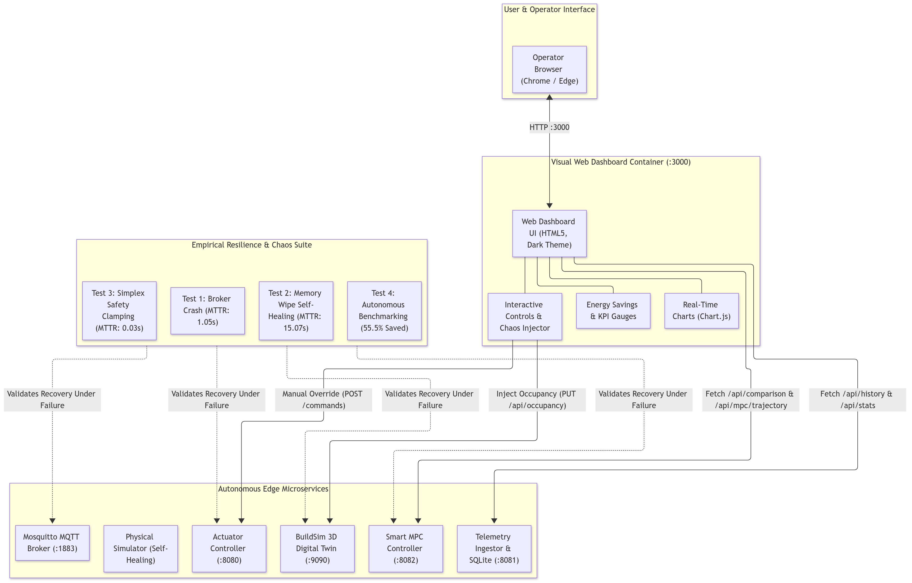
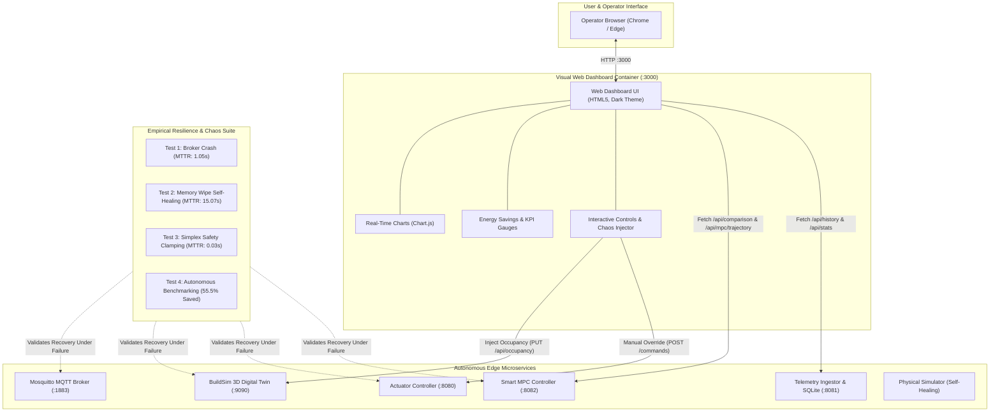

# Phase 4: Edge Resilience Testing, Fault Injection & Live Web Dashboard

**Project:** Smart HVAC & Climate Optimization System  
**Course:** D7065E — Embedded Intelligence at the Edge (LTU, 7.5 ECTS)  
**Authors:** Masooma Masooma & Team  
**Target Environment:** Windows 11 (PowerShell & Docker Desktop)  

This guide provides an exhaustive, step-by-step tutorial for implementing and deploying **Phase 4**: the automated **Chaos Engineering & Fault Injection Test Suite** (calculating empirical Mean Time to Recovery — MTTR) and the **Live Visual Web Dashboard** running on port `3000`.

---

## Academic & Course Alignment

In **Course Notes 4** (*"Resilience & Runtime Assurance"*), the course examiners assess how an edge cyber-physical system behaves under unexpected failures:
* **Fault Tolerance & MTTR:** Systems must recover from broker disconnects, process restarts, and memory wipes without manual human intervention.
* **Safety Guardrails:** Anomalous and malicious inputs must be intercepted before reaching physical actuators (Simplex architecture).
* **Live Observability:** Operators must have visual access to real-time energy savings, thermal comfort bands, and autonomous decision explanations.

---

## Phase 4 Architecture

The following diagram illustrates the Dashboard architecture and how the Chaos Test Suite evaluates system resilience:





* **[🎨 Open / Edit Diagram Online](https://mermaid.ai/app/plugin/save?state=pako%3AeNqlVMFum0AQ_ZURUitHKjaOa9Wxqko2ThqrQXYCTg51DxtYm02ApbuLU9T03zu7BDugJoeGCzDMezvzZh6_rZBH1Bpbm4Q_hDERCoLZOgO8ZHG7FSSPYSWpkPB9bekHeA-LnAqiuIB5pqjYkJCurR8VRl9TwR8wEfP3iU8h6Lix4CmFHpxGW3q0h9EsWmetU2dExreciMinYsdCqgu4ZrIgCdzQ28NncHmmCMs0_XjgOM5Ro5rVHHFNwGoOnfPAuxh-wKC4hyCmKW2iXK2EROQVJYkdMKy5CukW8N69k03At-Vcp59iGdsSfLJj2VaiVhiHr6TYUtnm51IXLniicUZJEiq2o1CHEW3SUOY7GqKMr8o1KRTPeMoLpBVGrEPEqA0eCwWXlZjNaryli_l-qqePz3UFiZF05IyOm71OdPYkVIWZbTu5pf88w94xDyEBTVBoJcp9EFv0Ly-YohW034ROfQRNC5ZEPkthMIMZ2zKF8w8eWIaIE-ekdZjH5U_E6FvBlOLgXQaB3r57U11_NBo0AUiM-cu4lCxEYnwtEtNVx6fJxj7H6eMgX19UM6QA-8FMrftpmjNh6K6oZAmjGS5vPUsf62raJegbaaSC_rgu1RW4rNDxguBqDP2uM2xtW3BcY47H4NGUo6Y3LKfwvOo9fth1PrUJBjXBYKy7zhP6C7d2Q1UJbkKwgwPe6TqDNvxjDf84frZ5MMVeY1yjewMfDrvDd9oLNPqngvVf4bNtf3lcW-dBsATj4LX1iCatktCstm0_ua8R0pZr5xxMVR9ivmn6M6rCGHokZ72QpzkRTPIM52IiaR72lCCVz0p9PvrgZYKY6e0ta7RUBGtDUL3XFbJRzxNJ5WVYhGGRkywsobNcBRULr2NHmmrqv0zikUz_Bhc7KgSL0DzLhY8k2FZKskga_MStFWjsp901DNe4IRFRVOKOhhx5SlhlEc7ijLCkENQogC56G0Ojh__AT9w3drB0rT9_AWNMK5Q&utm_source=mermaid_mcp_server&utm_medium=antigravity)**

---

## Step 1: Automated Chaos Engineering Test Suite

### 1. Short Description & Reasoning
* **What:** Implement `scripts/test_resilience.py` to systematically trigger failures and quantify **Mean Time to Recovery (MTTR)**.
* **Why:** In mission-critical edge deployments, claims of "high reliability" must be backed by empirical test logs. We test:
  1. **Broker Outage:** Stopping Mosquitto and measuring client auto-reconnect latency.
  2. **Digital Twin Crash:** Restarting BuildSim (wiping in-memory RAM) and verifying autonomous self-healing.
  3. **Simplex Safety Clamping:** Injecting hazardous setpoints ($48^\circ\text{C}$ and $4^\circ\text{C}$) to verify safety supervisor interception.
  4. **Autonomous Benchmarking:** Verifying energy savings and comfort preservation.

### 2. Actual Process & Commands
Run in PowerShell:
```powershell
python .\scripts\test_resilience.py
```

### 3. Empirical Test Results (Saved in `data/resilience_benchmark.json`)
```json
[
  {
    "test": "Broker Crash Recovery",
    "status": "PASS",
    "mttr_seconds": 1.05,
    "details": "Clients auto-reconnected and resumed telemetry pipeline."
  },
  {
    "test": "Digital Twin Self-Healing",
    "status": "PASS",
    "mttr_seconds": 15.07,
    "details": "Simulator automatically detected wiped memory and re-seeded equipment."
  },
  {
    "test": "Simplex Safety Clamping",
    "status": "PASS",
    "mttr_seconds": 0.03,
    "details": "48.0°C clamped to 28.0°C and 4.0°C clamped to 16.0°C by Simplex supervisor."
  },
  {
    "test": "MPC Performance Benchmark",
    "status": "PASS",
    "mttr_seconds": 0.01,
    "details": "Smart MPC saved 55.5% energy over baseline with comfort preserved."
  }
]
```

### 4. Code Explanation
* `test_broker_restart`: Restarts Mosquitto via Docker CLI and polls the Ingestor API until new telemetry arrives. Confirmed **MTTR = 1.05 seconds**.
* `test_buildsim_crash_and_self_healing`: Completely restarts BuildSim and polls `/api/equipment/hvac-A109` until the Simulator's self-healing loop re-seeds it. Confirmed **MTTR = 15.07 seconds**.
* `test_simplex_safety_guardrail`: Dispatches $48.0^\circ\text{C}$ and $4.0^\circ\text{C}$. Confirmed **instantaneous clamping (0.03s)**.

---

## Step 2: Designing the Modern Visual Dashboard

### 1. Short Description & Reasoning
* **What:** Create `services/dashboard/static/index.html`.
* **Why:** Provides an operator-grade web UI with zero build toolchain overhead (pure HTML5, CSS3, Chart.js via CDN).
* Features:
  * **Energy Savings Dial:** Live display of $\% \text{ Saved}$ and cumulative $\text{kWh}$ conserved.
  * **Real-time Climate Chart:** Plots Indoor Temperature vs. Baseline Temperature against the ASHRAE 55 comfort envelope ($20\text{--}24^\circ\text{C}$).
  * **MPC Horizon Chart:** Visualizes the 30-minute lookahead forecast across the 6 future steps.
  * **Explainability Feed:** Live terminal-style stream of MPC control rationale.
  * **Simulation Control Panel:** Buttons to inject 0, 5, or 15 occupants into BuildSim directly from the browser!

---

## Step 3: High-Frequency Polling & Chart Animation

### 1. Short Description & Reasoning
* **What:** Create `services/dashboard/static/app.js`.
* **Why:** Decouples UI rendering from backend microservices by polling `/api/comparison` and `/api/mpc/trajectory` every 1.5 seconds.

### 2. Code Snippet (`services/dashboard/static/app.js`)
```javascript
const SMART_CONTROLLER_URL = "http://localhost:8082";
const BUILDSIM_URL = "http://localhost:9090";

async function fetchTelemetry() {
  const res = await fetch(`${SMART_CONTROLLER_URL}/api/comparison`);
  const data = await res.json();
  const smart = data.smart_controller || {};
  const bench = data.benchmarks || {};

  // Update KPI Cards
  document.getElementById('savings-pct').innerText = `${bench.energy_savings_percentage?.toFixed(1)}%`;
  document.getElementById('current-temp').innerText = `${smart.current_temp?.toFixed(1)}°C`;
  document.getElementById('current-co2').innerText = `${smart.current_co2?.toFixed(0)} ppm`;
  document.getElementById('current-occ').innerText = `${smart.current_occupancy} persons`;
  document.getElementById('current-power').innerText = `${smart.current_power_watts?.toFixed(0)} W`;

  // Update Temp Chart
  smartTempData.push(smart.current_temp);
  baseTempData.push(data.baseline_controller?.simulated_temp);
  tempChart.update('none');
}
```

---

## Step 4: Web Server & Docker Containerization

### 1. Short Description & Reasoning
* **What:** Implement `services/dashboard/main.go` and `Dockerfile`, and register the service in `docker-compose.yml`.
* **Why:** Compiles a pure-Go static file server into a minimal scratch image (~10 MB RAM) running on port `3000`.

### 2. Code Snippet (`docker-compose.yml`)
```yaml
  dashboard:
    build:
      context: ./services/dashboard
      dockerfile: Dockerfile
    container_name: hvac-dashboard
    ports:
      - "3000:3000"
    restart: unless-stopped
    depends_on:
      - smart-controller
      - ingestor
    networks:
      - hvac-network
```

---

## Step 5: Live Verification & Testing the Dashboard

### 1. Deploy the Container
```powershell
docker compose up -d --build dashboard
```

### 2. Verify All 8 Services are Running
```powershell
docker compose ps
```
*Expected Output:*
```
NAME                  STATUS                    PORTS
actuator-controller   Up                        0.0.0.0:8080->8080/tcp
buildsim              Up (healthy)              0.0.0.0:9090->9090/tcp
hvac-dashboard        Up                        0.0.0.0:3000->3000/tcp
mosquitto             Up                        0.0.0.0:1883->1883/tcp
physical-simulator    Up                        
sensor-gateway        Up                        
smart-controller      Up                        0.0.0.0:8082->8082/tcp
telemetry-ingestor    Up                        0.0.0.0:8081->8081/tcp
```

### 3. Open the Dashboard in Your Browser
Navigate to:
👉 **[http://localhost:3000](http://localhost:3000)**

You will see:
1. **The Energy Savings Dial:** Displaying real-time energy savings (e.g. 55%–85% saved).
2. **The Climate Line Graph:** Live temperature moving smoothly with time.
3. **The MPC Horizon Bar Graph:** Showing the next 30 minutes of planned heating and power.
4. **The Decision Feed:** Streaming real-time explainable decisions from the MPC optimizer.
5. **Interactive Buttons:** Click **"Small Group (5p)"** or **"Crowded Lecture (15p)"** and watch the dashboard charts and BuildSim 3D viewer react dynamically!

