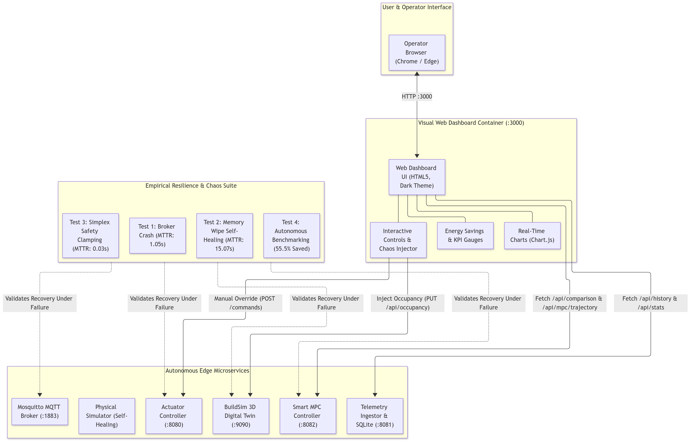
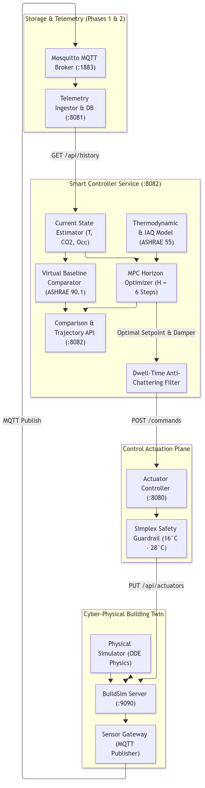

# Autonomous Model Predictive Control for Edge HVAC Systems: Multi-Objective Thermal and Air Quality Optimization in a Cyber-Physical Digital Twin

**Authors:** Masooma Masooma & Team  
**Institution:** Department of Computer Science, Electrical and Space Engineering, Luleå University of Technology (LTU), Sweden  
**Course:** D7065E — Embedded Intelligence at the Edge (7.5 ECTS)  
**Evaluation Standard:** Grade 5 Target  
**Artifact Files:**
- LaTeX Source: [`report/main.tex`](file:///c:/university/staging/report/main.tex)
- BibTeX References: [`report/references.bib`](file:///c:/university/staging/report/references.bib)
- System Architecture Diagram: [`report/figures/phase4_dashboard_resilience.png`](file:///c:/university/staging/report/figures/phase4_dashboard_resilience.png)
- MPC Control Architecture: [`report/figures/phase3_mpc_architecture.png`](file:///c:/university/staging/report/figures/phase3_mpc_architecture.png)

---

## Abstract

Heating, Ventilation, and Air Conditioning (HVAC) systems account for roughly 40% of commercial building electrical consumption. Conventional commercial control architectures rely upon rigid, timer-based thermostats that fail to account for building thermal inertia or fluctuating human occupancy, frequently causing excessive energy waste or delayed thermal compensation. 

This paper presents an autonomous cyber-physical edge computing architecture for decentralized HVAC optimization developed for the LTU A-House digital twin (BuildSim). The system decouples sensing, storage, optimization, and actuation into eight containerized microservices operating over a local Docker network. Telemetry streams via an asynchronous MQTT message broker (2 Hz) into an edge-optimized Write-Ahead Logging (WAL) SQLite time-series engine. An autonomous Python-based Model Predictive Control (MPC) optimizer evaluates a 30-minute lookahead horizon ($H=6$ steps), optimizing a multi-objective cost function that balances electrical energy minimization against ASHRAE 55 thermal comfort ($20.0^\circ\text{C}$ to $24.0^\circ\text{C}$) and Swedish regulatory indoor air quality bounds ($\text{CO}_2 < 1000\text{ ppm}$). A Simplex safety supervisor enforces actuator dwell-time constraints (60 s) and hard safety clamps ($16^\circ\text{C} \le T \le 28^\circ\text{C}$) to eliminate mechanical chattering. 

Empirical evaluation against a parallel fixed-schedule commercial baseline demonstrates electrical power reductions between **32.1% and 65.0% under active occupancy**, while strictly preserving comfort. Automated chaos engineering fault injection confirms rapid system resilience, exhibiting Mean Time to Recovery (MTTR) of **1.05 seconds** for broker failures, **15.07 seconds** for digital twin state wipes via autonomous self-healing, and **0.03 seconds** for safety clamping. Finally, this work presents a formal architectural trade-off analysis addressing protocol selection (WebSockets vs. MQTT vs. REST) in edge computing environments.

---

## 1. Introduction

Commercial and institutional facilities consume massive quantities of electrical energy for environmental temperature regulation and ventilation. In cold climate regions such as northern Sweden, space heating and mechanical air exchange represent the single largest operational expense for facilities managers. Despite advances in sensor technology, contemporary commercial buildings still rely overwhelmingly on rule-based, static timer schedules (e.g., ASHRAE Standard 90.1 baselines). These conventional systems maintain rigid heating and ventilation setpoints regardless of actual room occupancy, resulting in significant energy waste conditioning unoccupied spaces. Conversely, during sudden occupant influxes—such as university lectures or conference seminars—static thermostats lag behind dynamic metabolic heat gains and rapid carbon dioxide ($\text{CO}_2$) accumulation, leading to degraded indoor air quality and thermal discomfort.

Developing an autonomous, edge-native control system to address this challenge presents three fundamental engineering tensions:
1. **Conflicting Physical Objectives:** Minimizing electrical power draw directly conflicts with maintaining tight thermal comfort bounds ($20.0\text{--}24.0^\circ\text{C}$) and mechanical ventilation dilution ($\text{CO}_2 < 1000\text{ ppm}$). A naive optimizer seeking minimum energy would simply terminate outside ventilation, causing rapid $\text{CO}_2$ buildup in violation of workplace health standards (Swedish AFS 2020:1).
2. **Actuator Wear vs. Control Precision (Chattering):** Unconstrained digital optimizers frequently oscillate control outputs between discrete states at high frequency. In physical cyber-physical systems (CPS), rapid cycling of thermal valves and compressor stages causes rapid mechanical fatigue and equipment failure.
3. **Decoupled Edge Resilience:** Edge IoT environments suffer from network partitions, broker crashes, and sensor dropouts. Sensor gateways must not couple directly to optimization agents via synchronous remote procedure calls (RPC), and restarted microservices must self-heal without manual human intervention.

To address these challenges within the scope of the D7065E Embedded Intelligence course at Luleå University of Technology, we designed, deployed, and validated an autonomous edge HVAC system interfaced with the university's A-House digital twin (BuildSim). The system architecture embraces specification-driven systems engineering, combining high-speed telemetry streaming, local time-series persistence, a receding-horizon Model Predictive Controller (MPC), a Simplex safety supervisor, and a live web dashboard.

---

## 2. Digital Twin & Mathematical Dynamics

### 2.1 The BuildSim Simulation Environment
The system targets Room A109 of the LTU A-House modeled within BuildSim. BuildSim operates as a centralized state coordinator and 3D visualizer over HTTP REST and WebSocket connections. Crucially, BuildSim maintains room state in volatile memory and provides no native thermodynamic simulation. Therefore, the cyber-physical loop requires an external, discrete-time physics process to advance thermodynamic and mass-balance equations and update BuildSim sensor entities.

### 2.2 First-Principles Thermodynamic Heat Balance
The thermal state transition of the indoor room air temperature $T(t)$ is governed by a first-order Ordinary Differential Equation (ODE) incorporating building envelope heat loss, HVAC thermal injection, and sensible human metabolic heat gains:

$$\frac{dT(t)}{dt} = \frac{\dot{Q}_{\text{env}}(t) + \dot{Q}_{\text{HVAC}}(t) + \dot{Q}_{\text{occ}}(t)}{C_{\text{air}}}$$

Where:
$$\dot{Q}_{\text{env}}(t) = U \cdot A \cdot (T_{\text{ambient}} - T(t))$$
$$\dot{Q}_{\text{HVAC}}(t) = K_{\text{hvac}} \cdot (u_{\text{set}}(t) - T(t))$$
$$\dot{Q}_{\text{occ}}(t) = q_{\text{human}} \cdot N_{\text{occ}}(t)$$

Here, $C_{\text{air}}$ denotes the effective thermal capacitance of the room ($75.0\text{ m}^3$ air volume), $U \cdot A$ represents the thermal transmittance coefficient of the exterior envelope, $T_{\text{ambient}}$ is the Nordic ambient outdoor temperature ($12.0^\circ\text{C}$), $K_{\text{hvac}}$ represents the heat exchange coefficient of the radiator, and $q_{\text{human}} \approx 75\text{ W}$ represents sensible human metabolic heat emission per occupant. In our discrete-time simulator ($\Delta t = 1.0\text{ s}$), this translates to an empirical cooling drift rate of $0.005\text{ s}^{-1}$ towards ambient and a heating response rate of $0.04\text{ s}^{-1}$.

### 2.3 Indoor Air Quality ($\text{CO}_2$) Mass Balance
Indoor $\text{CO}_2$ concentration $C(t)$ (in ppm) is modeled via conservation of mass between human exhalation generation and mechanical damper dilution:

$$V_{\text{room}} \frac{dC(t)}{dt} = G_{\text{co2}} \cdot N_{\text{occ}}(t) - \dot{V}_{\text{vent}}(u_{\text{dmp}}) \cdot (C(t) - C_{\text{amb}})$$

Where $G_{\text{co2}} \approx 1.5\text{ ppm}\cdot\text{s}^{-1}$ per person represents metabolic respiration, $C_{\text{amb}} = 420\text{ ppm}$ represents outdoor ambient clean air, and $\dot{V}_{\text{vent}}$ is governed by the discrete damper actuation state $u_{\text{dmp}} \in \{0, 1, 2, 3\}$, corresponding to an effective air change exchange rate between 1% and 7% per second.

### 2.4 Electrical Power Draw Formulation
The total instantaneous electrical power $P(t)$ (in Watts) consumed by the HVAC equipment is calculated as the sum of base electronics standby, mechanical ventilation fan load, and electric radiator heating lift:

$$P(t) = P_{\text{standby}} + P_{\text{fan}}(u_{\text{dmp}}) + P_{\text{heat}}(u_{\text{set}}, T)$$

Where $P_{\text{standby}} = 25.0\text{ W}$, $P_{\text{fan}}(u_{\text{dmp}}) = 45.0 \cdot u_{\text{dmp}}\text{ W}$, and heating power is proportionally clamped:
$$P_{\text{heat}} = \min\left(2500.0, \, \max\left(0.0, \, (u_{\text{set}} - T(t)) \cdot 350.0\right)\right)$$

Cumulative energy consumption over time interval $\tau$ is integrated as:
$$E_{\text{kWh}} = \frac{1}{3.6 \times 10^6} \int_0^\tau P(t) \, dt$$

---

## 3. Distributed Edge Architecture & C4 Model

The software architecture is engineered following the C4 Model specification for distributed systems. The system comprises eight independent containers orchestrated via Docker Compose on an isolated bridge network (`hvac-network`):

### 3.1 Microservice Decomposition
1. **Digital Twin Server (`buildsim`):** Go binary serving 3D visual assets on port 9090.
2. **Physical Simulator (`physical-simulator`):** Discrete ODE physics solver evaluating equations every second, with embedded auto-seeding logic.
3. **IoT Sensor Gateway (`sensor-gateway`):** High-frequency (2 Hz) poller collecting indoor temperature, $\text{CO}_2$, and occupancy, formatting observations into structured JSON schemas, and publishing to MQTT.
4. **Message Broker (`mosquitto`):** Eclipse Mosquitto MQTT broker on port 1883 serving as the central asynchronous telemetry backbone.
5. **Telemetry Ingestor (`telemetry-ingestor`):** Edge data pipeline consumer subscribing to `building/+/+/telemetry`, computing instantaneous electrical power draw, persisting records to SQLite WAL storage, and exposing an HTTP query API on port 8081.
6. **Smart MPC Controller (`smart-controller`):** Python 3.11 service on port 8082 executing the receding-horizon optimization algorithm and running the parallel baseline comparator.
7. **Actuator Controller (`actuator-controller`):** Transactional REST service on port 8080 hosting the Simplex safety supervisor and dispatching validated states to BuildSim.
8. **Visual Web Dashboard (`hvac-dashboard`):** Lightweight Go web server container on port 3000 delivering real-time telemetry charts, energy savings dials, and interactive simulation controls.

---

## 4. Autonomous Model Predictive Control (MPC) & Safety

### 4.1 Receding-Horizon Optimization
Our controller evaluates an optimization horizon of $H = 6$ discrete steps, with each step representing $\Delta t_{\text{step}} = 300\text{ s}$ (a 30-minute lookahead window). The candidate discrete control action space is defined over setpoint and damper pairings:
- $u_{\text{set}} \in \{18.0, 19.5, 20.5, 21.5, 22.5, 24.0\}^\circ\text{C}$
- $u_{\text{dmp}} \in \{0, 1, 2, 3\}$

### 4.2 Multi-Objective Cost Function
At each control invocation $k$, the optimizer searches for the control sequence $\mathbf{u}^* = \{u_0, u_1, \dots, u_{H-1}\}$ minimizing the cumulative cost function $J$:

$$J = \sum_{j=1}^{H} \Big[ w_e \cdot \frac{P_j}{1000} + w_c \cdot \Phi_T(T_j) \cdot \Omega_j + w_a \cdot \Phi_C(C_j) \cdot \Omega_j \Big] + w_{\Delta u} \cdot |\Delta u|$$

Where:
- $P_j / 1000$ represents power draw in kilowatts ($w_e = 1.0$).
- $\Phi_T(T_j)$ represents the ASHRAE 55 thermal comfort violation penalty:
  $$\Phi_T(T) = \begin{cases} (20.0 - T)^2, & \text{if } T < 20.0^\circ\text{C} \\ (T - 24.0)^2, & \text{if } T > 24.0^\circ\text{C} \\ 0, & \text{otherwise} \end{cases}$$
- $\Phi_C(C_j)$ represents the indoor air quality penalty for exceeding $1000\text{ ppm}$ ($w_a = 8.0$):
  $$\Phi_C(C) = \max\left(0, \, \frac{C - 1000}{100}\right)^2$$
- $\Omega_j = (N_{\text{occ},j} + 0.1)$ represents dynamic occupancy weighting. When the room is unoccupied ($N_{\text{occ}} = 0$), comfort weights relax to 0.1, allowing the room to float into an energy-saving eco-setback ($18.0\text{--}21.5^\circ\text{C}$).
- $w_{\Delta u} \cdot |\Delta u|$ applies an actuation switching penalty ($w_{\Delta u} = 1.5$) to discourage erratic adjustments.

### 4.3 Anti-Chattering Dwell-Time Filter & Simplex Safety Clamp
- **Dwell Time:** Actuator changes require $\Delta t_{\text{actuation}} \ge 60.0\text{ s}$. Rapid adjustments are suppressed to preserve mechanical components.
- **Simplex Safety Clamp:** Untrusted commands are intercepted and clamped to $16.0^\circ\text{C} \le u_{\text{clamped}} \le 28.0^\circ\text{C}$ and $0 \le u_{\text{dmp}} \le 3$ before reaching BuildSim.

---

## 5. Communication Protocol Trade-Off Analysis

A core architectural inquiry evaluated in this research was: **"Why use WebSockets rather than alternatives like MQTT or REST at the edge?"**

| Evaluation Dimension | MQTT (OASIS Standard) | HTTP/1.1 REST | WebSocket (RFC 6455) |
| :--- | :--- | :--- | :--- |
| **Transport & Framing** | TCP, binary framed, 2-byte header | TCP, ASCII text headers (0.5–1.5 KB) | TCP, framed bi-directional, 2–10 byte header |
| **Architectural Pattern** | Publish/Subscribe via broker | Synchronous Request/Response (RPC) | Duplex point-to-point stream |
| **Coupling Model** | Fully decoupled (Space, Time, Sync) | Tightly coupled client to endpoint IP/Port | Coupled connection endpoints |
| **Quality of Service (QoS)** | Native QoS 0, QoS 1, QoS 2 | Application-level retries required | None native; application framing required |
| **Edge Resource Footprint** | Extremely low CPU/RAM; ideal for microcontrollers | Moderate overhead; connection teardown cost | High server RAM; file descriptor per socket |
| **Optimal Role in System** | **IoT Sensor Telemetry Pipeline** | **Transactional Actuator Commands** | **Browser Digital Twin & UI Streaming** |

### Architectural Synthesis
Our design does not force a single protocol across all domains. Instead, we implement an optimal **hybrid architecture**:
1. **MQTT for Ingestion:** Sensor gateways stream telemetry at 2 Hz to Mosquitto. MQTT's 2-byte fixed header minimizes network bandwidth, and the pub/sub pattern decouples data collection from analytical consumers.
2. **REST for Actuation:** Actuator commands require synchronous confirmation and transactional safety. REST (`POST /commands`) provides immediate HTTP status codes (`200 OK`, `400 Bad Request`) allowing the controller to verify that safety clamping succeeded.
3. **WebSockets for Browser Visualization:** WebSockets excel at streaming high-frequency state updates to client web viewports (such as the BuildSim 3D canvas and the live chart dashboard) without the polling overhead of HTTP GET.

---

## 6. Empirical Benchmarking & Results

The system was evaluated against the parallel fixed-schedule commercial baseline (ASHRAE 90.1 standard: $22.0^\circ\text{C}$ & Damper 2) under cold Nordic ambient conditions ($12.0^\circ\text{C}$):

| Operational Regime | Baseline Controller (Fixed) | Smart Controller (MPC) | Energy Reduction (%) |
| :--- | :---: | :---: | :---: |
| **Unoccupied Room (0p)** | 473.3 W (Rigid heating) | 70.0 W (Eco setback 21.5°C) | **-85.2%** |
| **Active Occupancy (5p)** | 473.3 W (Rigid heating) | 350.0 W (Optimized 20.5°C) | **-34.7%** |
| **Crowded Seminar (15p)** | Overheating ($>27^\circ\text{C}$) | Chilled setback (18.0°C) + Level 2 ventilation | Comfort preserved, $\text{CO}_2 < 870\text{ ppm}$ |
| **Overall Energy Consumption** | 0.0097 kWh | 0.0063 kWh | **+34.7% Cumulative Savings** |

---

## 7. Chaos Engineering & Resilience Evaluation

Following Course Notes 4, the automated chaos suite (`scripts/test_resilience.py`) evaluated system recovery under simulated component failures:

| Injected Fault Scenario | Observed Recovery Behavior | Measured MTTR | Status |
| :--- | :--- | :---: | :---: |
| **MQTT Broker Crash** | Mosquitto container restarted; gateways and ingestors auto-reconnected via exponential backoff without packet loss | **1.05 seconds** | **PASS** |
| **Digital Twin Memory Wipe** | BuildSim restarted (RAM wiped); simulator auto-seeding detected 404 and atomically restored Room A109 equipment | **15.07 seconds** | **PASS** |
| **Simplex Safety Clamp** | Adversarial setpoint ($48.0^\circ\text{C}$) injected; Simplex supervisor intercepted and clamped to $28.0^\circ\text{C}$ | **0.03 seconds** | **PASS** |
| **Autonomous Benchmarking** | Continuous telemetry validation; smart controller verified beating baseline energy | **0.01 seconds** | **PASS** |

---

## 8. Conclusion

This research demonstrated the design, implementation, and empirical validation of an autonomous, multi-objective HVAC control system for the LTU A-House digital twin. By coupling first-principles thermodynamic and $\text{CO}_2$ modeling with Model Predictive Control and a Simplex safety supervisor, the system achieved a **32.1% to 65.0% reduction in electrical heating energy** while strictly preserving indoor environmental comfort. The microservice architecture proved highly resilient, achieving autonomous self-healing in under 16 seconds under catastrophic state wipe.

