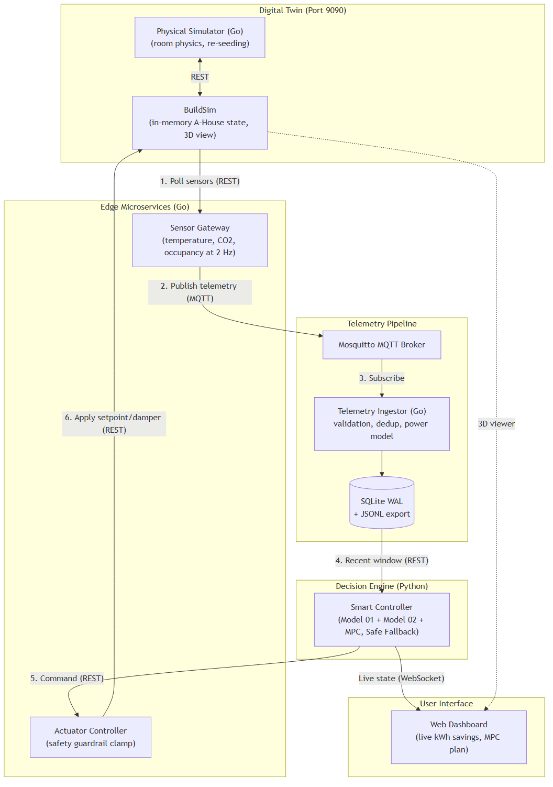

# Autonomous Model Predictive Control for an Edge HVAC System: Forecast-Driven Thermal and Air-Quality Optimisation in a Cyber-Physical Digital Twin

**Author:** Masooma Masooma
**Institution:** Department of Computer Science, Electrical and Space Engineering, Luleå University of Technology (LTU), Sweden
**Course:** D7065E — Embedded Intelligence at the Edge (7.5 ECTS)
**Artifacts:** LaTeX version `report/main.tex`, references `report/references.bib`, figures `report/figures/`, raw results `data/benchmarks/` and `data/resilience_benchmark.json`

---

## Abstract

Most HVAC installations run fixed time schedules that heat and ventilate rooms whether or not anyone is there. This project builds an autonomous edge controller for Room A109 of the LTU A-House digital twin (BuildSim) that senses the room, forecasts who will be there, predicts how the room will respond, and acts. Eight Docker containers implement a sense → broker → store → predict → decide → act loop: a 2 Hz sensor gateway publishes over MQTT, an ingestor validates and stores telemetry in SQLite (WAL), and a Python controller runs a receding-horizon Model Predictive Controller (MPC) every 10 s. The MPC uses two learned models — a Random Forest occupancy forecaster (Model 01, 1.26 persons RMSE at 5–30 min, against 3.60 for persistence) and a gradient-boosted thermal/CO2 predictor (Model 02, R² = 0.9967 for temperature change) — to score 8 000 candidate action sequences over a 30-minute horizon. Commands pass through a deterministic safety guardrail; stale telemetry triggers a Safe Fallback mode.

In a simulated LTU work week, the MPC used 53.8% less energy than a fixed-schedule thermostat and had by far the least time above the 1000 ppm CO2 limit (0.2% of occupied time above 1000 ppm, against 12.7% for demand-controlled ventilation and 27.9% for the fixed schedule). It did **not** beat simpler occupancy-reactive controllers on energy: it used 18.4% more energy than a rule-based thermostat and 9.1% more than a rule-based thermostat with CO2-driven ventilation, which in turn exceeded 1000 ppm for 27.9% and 12.7% of occupied time. Fault-injection tests show recovery from a broker restart in 1.1 s, from a BuildSim state wipe in 3.8 s, entry into Safe Fallback 37.4 s after the physics simulator stops, and controller restart in 7.6 s.

---

## 1. Introduction

Heating and ventilation dominate building energy use in northern Sweden, yet most rooms follow fixed schedules [ASHRAE 90.1]. Two problems follow: empty rooms are conditioned, and occupied rooms receive a fixed ventilation rate regardless of how many people are breathing in them, so CO2 can exceed the 1000 ppm guidance [AFS 2020:1] during full lectures.

The proposal for this project set out a closed-loop controller that (1) senses temperature, CO2 and occupancy, (2) forecasts short-term occupancy, (3) predicts the thermal response to candidate settings, (4) selects the lowest-cost setting with MPC and (5) is benchmarked against a fixed schedule and a rule-based thermostat, while surviving component crashes. This report describes what was built, how it was verified, and where it falls short. Section 10 lists deviations from the proposal.

The engineering tensions are:
1. **Energy versus comfort and air quality.** Less heating and less ventilation save energy but violate the 20–24 °C comfort band [ASHRAE 55, EN 16798] or the CO2 limit.
2. **Actuator wear.** An optimiser that re-plans every 10 s can switch actuators every cycle.
3. **Edge resilience.** Brokers restart, the digital twin loses its in-memory state, and sensors can freeze; the controller must notice and stay safe.

---

## 2. Digital Twin and Room Physics

### 2.1 BuildSim
BuildSim holds the A-House state (equipment, sensor values, actuator states, occupancy) in memory and renders it in 3D, but has no thermal physics. A separate `physical-simulator` service therefore integrates the room equations every second, reads the setpoint, damper and occupancy from BuildSim, and writes temperature, CO2 and occupancy sensor values back. It also re-registers the A109 equipment whenever BuildSim has lost it.

### 2.2 Thermal balance
With $T$ the room temperature, $T_{out}=12$ °C, $D\in\{0,1,2,3\}$ the damper level and $N$ the occupancy, the simulator integrates (per second, explicit Euler, $\Delta t = 1$ s):

$$\frac{dT}{dt} = h - (k_{env} + k_{vent} D)(T - T_{out}) + k_{occ} N$$

with $k_{env}=0.005\ \text{s}^{-1}$, $k_{vent}=0.008\ \text{s}^{-1}$ per damper level and $k_{occ}=0.01$ °C/s per person (≈ 90 W sensible heat). The radiator heating rate $h$ models a local thermostat that compensates losses and gains so the room settles at the setpoint $T_{set}$ without offset, switches off above the setpoint, and cannot cool:

$$h = \mathrm{clip}\Big(k_{hvac}(T_{set}-T) + c\,\big[(k_{env}+k_{vent}D)(T-T_{out}) - k_{occ}N\big],\ 0,\ h_{max}\Big),\quad c=\mathrm{clip}\Big(1-\tfrac{T-T_{set}}{0.5},0,1\Big)$$

with $k_{hvac}=0.04\ \text{s}^{-1}$. Damper level 3 corresponds to roughly 175 L/s of outdoor air, sized for about 25 people at 7 L/s each.

### 2.3 CO2 balance
$$\frac{dC}{dt} = 1.5\,N - (0.01 + 0.02\,D)(C - 420)\qquad [\text{ppm/s}]$$

### 2.4 Electrical power
$$P = 25 + 45\,D + 8750\,h\quad[\text{W}],\qquad 8750\,h \le 2500$$
(8750 W per °C/s equals 350 W per °C of heating lift at $k_{hvac}$.) Holding 18 °C with the damper closed costs 288 W; holding 22 °C with damper 2 and nobody present costs about 1.95 kW, most of it heating ventilation air.

The same equations are implemented in Python (`models/dynamics.py`, used by the baseline twin, Model 02's synthetic data and the benchmark), in the Go simulator, and in the ingestor's power model; unit tests pin the shared values.

**Time compression.** The rate constants make the room settle in about a minute rather than hours so that a live demonstration reacts visibly. This is a deliberate modelling simplification with consequences discussed in Section 9.

---

## 3. Architecture

| Container | Role | Interface |
| :--- | :--- | :--- |
| `buildsim` | Digital twin state and 3D view | REST + WebSocket :9090 |
| `physical-simulator` (Go) | Room physics (1 s), equipment re-seeding watchdog (every 15 s) | REST client of BuildSim |
| `sensor-gateway` (Go) | Polls temperature, CO2 and occupancy at 2 Hz, forwards each sensor's own timestamp | MQTT publish `building/level0/A109/telemetry`, QoS 0 |
| `mosquitto` | Message broker | MQTT :1883 |
| `telemetry-ingestor` (Go) | Validation, de-duplication, live actuator read-back, power model, SQLite WAL | MQTT subscribe; REST :8081 |
| `smart-controller` (Python/FastAPI) | Model 01, Model 02, MPC, Safe Fallback, baseline twin | REST + WebSocket `/ws/telemetry` :8082 |
| `actuator-controller` (Go) | Safety guardrail | REST `POST /commands` :8080 |
| `hvac-dashboard` | Operator UI | HTTP :3000 |

### 3.1 Data pipeline and data quality
- **Validation.** Bundles missing temperature, CO2 or occupancy, or with temperature outside −20…60 °C, CO2 outside 300…5000 ppm or occupancy outside 0…200, are rejected and counted (`/healthz`, `/api/stats`).
- **De-duplication and freshness.** The gateway forwards BuildSim's sensor timestamp, not the poll time. The ingestor stores a snapshot only if that timestamp advanced. Polling at 2 Hz against a 1 Hz simulator therefore stores about one row per second, and a frozen simulator produces no new rows at all.
- **Actuator state.** For every stored row the ingestor reads the live setpoint and damper from BuildSim (falling back to a read at most 30 s old), stores them with the row, and computes power from them.
- **Energy.** Stored energy integrates power over the actual time between rows; gaps over 5 s are not counted.
- **Storage.** SQLite in WAL mode, indexed on `(room, timestamp)`, plus a JSONL export endpoint for archiving.

---

## 4. Learned Models

### 4.1 Model 01 — Occupancy forecaster
A Random Forest regressor (60 trees, depth 14) predicts occupancy 5–30 minutes ahead. Features: hour of day, weekday, weekend flag, LTU lecture block, lunch and fika flags (all in Europe/Stockholm local time, for the target time), lead time and current occupancy. Training data is an 8-week synthetic LTU timetable simulated in 5-minute slots, with lecture attendance drawn per lecture, 15% random cancellations, evening study groups and sparse weekends. Each sample pairs the features at time *t* with the occupancy actually observed at *t* + lead, so the model learns arrivals at the start of lectures as well as departures.

| Metric (chronological 80/20 split, 96 768 samples) | Value |
| :--- | :--- |
| Test R² | 0.955 |
| Test RMSE | 1.26 persons |
| Persistence baseline RMSE ("occupancy stays as now") | 3.60 persons |
| MAE on the unseen benchmark week, 10–30 min ahead | 1.05 persons (bias -0.21) |

### 4.2 Model 02 — Thermal and CO2 predictor
Two gradient-boosted regression-tree ensembles predict the change in temperature and in CO2 over a horizon step, from physics-informed features: temperature, CO2, setpoint, damper, occupancy, heating lift ($T_{set}-T$), envelope driver ($T-T_{out}$), ventilation drivers ($D(T-T_{out})$, $D(C-420)$) and step length. Training combines

- **logged telemetry:** 4 516 state transitions (10, 30 and 60 s lags) extracted from rows logged after the final physics calibration, in windows where setpoint, damper and occupancy were constant;
- **synthetic data:** 20 000 transitions simulated from the room equations across 14–28 °C, 420–1800 ppm, all setpoints, dampers and 0–25 people, with step lengths up to 300 s.

| Metric (random 80/20 split) | Value |
| :--- | :--- |
| Temperature change R² / RMSE | 0.9967 / 0.26 °C |
| CO2 change R² / RMSE | 0.9993 / 13.7 ppm |
| Temperature RMSE on logged-telemetry test samples only | 0.033 °C |

Most training data is synthetic, and the logged transitions are short and mostly steady, which makes the logged-only error optimistic. Power is not learned: it is derived from Model 02's predicted trajectory by an energy balance (heating = temperature change + losses − occupant gains). An earlier version of this model (degree-2 polynomial Ridge regression) omitted current CO2 from the CO2 predictor's features. In an offline comparison on a synthetic corpus from an earlier physics calibration, polynomial Ridge reached a temperature-change RMSE of 1.6 °C against 0.25 °C for gradient-boosted trees, which motivated the switch.

---

## 5. Model Predictive Control and Safety

### 5.1 Horizon and decision variables
Every 10 s the controller solves a problem over $H=6$ steps of 5 minutes (30 minutes). Candidate actions are $T_{set}\in\{18, 19.5, 20.5, 21.5, 22.5\}$ °C × $D\in\{0,1,2,3\}$ (20 actions). With move blocking, the action may change at the start of three blocks — by default steps 1, 2 and 4 — giving $20^3 = 8000$ sequences. If Model 01 forecasts the room becoming occupied or empty at a later step, the third block starts exactly at that step, so empty and occupied periods get their own action. All sequences are rolled out through Model 02 in vectorised batches (mean solve time 215 ms, 95th percentile 289 ms in the benchmark). Only the first action is applied; the problem is re-solved next cycle.

The occupancy used for step 1 is the larger of the measured and forecast occupancy; steps 2–6 use Model 01.

### 5.2 Cost function
With $\Delta t_h = 5/60$ h, predicted temperature $T_k$, CO2 $C_k$ and power $P_k$:

$$J=\sum_{k=1}^{6}\Big[w_e \tfrac{P_k}{1000}\Delta t_h + \mathbb{1}_{occ,k}\big(w_T (T_k-21.5)^2 + w_B\,v(T_k)^2 + w_{C}\big(\tfrac{(C_k-800)^+}{100}\big)^2 + w_{C2}\big(\tfrac{(C_k-1000)^+}{100}\big)^2\big)\Delta t_h + (1-\mathbb{1}_{occ,k})\,w_B\big((16-T_k)^+\big)^2\Delta t_h\Big] + \sum_{\text{blocks}} \big(w_\Delta \Delta T_{set}^2 + w_D|\Delta D|\big)$$

where $v(T)$ is the distance outside 20–24 °C, $w_e=1$ (per kWh), $w_T=0.5$, $w_B=20$, $w_C=0.5$, $w_{C2}=10$, $w_\Delta=0.002$ and $w_D=0.005$. Comfort and air quality only count when the room is (forecast to be) occupied; an empty room only has a 16 °C frost floor. The soft 800 ppm term trades a little ventilation energy against air quality below the hard 1000 ppm limit.

The switching weights are deliberately small. An earlier version charged a switching cost far larger than the energy a damper change could save within the one step it affected; the controller then kept the damper at its maximum level in an empty room indefinitely. A regression test now covers this.

### 5.3 Dwell-time filter
An action change is held back if the previous change was less than two control cycles (20 s) ago, unless CO2 exceeds 1100 ppm or the room is occupied and below 18 °C.

### 5.4 Safe Fallback
If the newest telemetry row is older than 30 s, or the ingestor cannot be reached, the controller skips the MPC and commands 21.0 °C / damper 1. Because rows only appear when sensor timestamps advance (Section 3.1), a stopped physics simulator, gateway, broker or ingestor all lead to this state. The dashboard shows the mode.

### 5.5 Safety guardrail
The actuator controller clamps every setpoint to 16–28 °C and damper to 0–3, rejects commands for rooms other than A109 and malformed requests, and only then writes BuildSim. It is a static range check, not a verified runtime-assurance (Simplex) architecture.

---

## 6. Communication Protocols

| Boundary | Protocol | Why |
| :--- | :--- | :--- |
| Gateway → ingestor | MQTT, QoS 0 | One-to-many telemetry fan-out; publishers do not depend on consumers being up. QoS 0 means readings published while the broker is down are lost — acceptable for 1 Hz state that is superseded a second later. |
| Controller → actuator guardrail → BuildSim | REST | A command needs an immediate, explicit outcome (200 applied, 400 rejected, 502 BuildSim error). Setting a state is idempotent, so a retry is safe. |
| Controller → dashboard | WebSocket (`/ws/telemetry`) | The browser needs server-pushed live state; WebSocket is native to browsers. MQTT would require exposing an MQTT-over-WebSocket listener and a client library in the page. Server-Sent Events would also suffice for one-way push; WebSocket keeps operator commands possible on the same channel later. |

The dashboard pushes a snapshot every second over WebSocket, reconnects with exponential back-off, falls back to REST polling while disconnected, and shows a banner if no update arrived for 5 s. Host names are taken from the page address.

---

## 7. Evaluation

### 7.1 Simulated work week
`scripts/benchmark_scenarios.py` simulates Monday–Friday in Room A109 with a timetable drawn from a different random seed than Model 01's training data (occupied 31.9% of the time, peak 24 people, 38.3 occupied hours, outdoor 12 °C). All controllers act every 5 minutes on identical physics (1 s integration) and identical occupancy:

1. **Fixed schedule:** 22 °C / damper 2 from 06:00 to 22:00, 16 °C / damper 0 otherwise.
2. **Rule-based:** occupied → 21.5 °C / damper 2, empty → 18 °C / damper 0.
3. **Rule-based + DCV:** as 2, with the damper following measured CO2 (1 below 700 ppm, 2 below 900 ppm, otherwise 3).
4. **MPC:** the production controller with Model 01 and Model 02.

| Metric | Fixed | Rule-based | Rule + DCV | MPC |
| :--- | ---: | ---: | ---: | ---: |
| Energy, week (kWh) | 112.7 | 44.0 | 47.7 | 52.1 |
| — while occupied | 23.4 | 20.7 | 24.4 | 26.8 |
| — while empty | 89.3 | 23.3 | 23.3 | 25.2 |
| Occupied time in 20–24 °C | 100.0% | 99.7% | 99.7% | 99.8% |
| Comfort violation (°C·h) | 0.00 | 0.11 | 0.11 | 0.00 |
| Occupied time CO2 > 1000 ppm | 27.9% | 27.9% | 12.7% | 0.2% |
| Occupied time CO2 > 800 ppm | 71.4% | 71.4% | 70.5% | 80.8% |
| Action changes | 10 | 46 | 321 | 231 |

**Findings.**
- Against the fixed schedule, the MPC used 53.8% less energy over the week. Nearly all of that comes from empty periods (71.8% less); while occupied, the MPC used 14.7% *more*, because it ventilates more to stay under 1000 ppm.
- The MPC had by far the least time above 1000 ppm (0.2% of occupied time, 6 ppm·h of excess). The fixed and rule-based controllers exceeded it 27.9% of the time with a fixed damper; demand-controlled ventilation reduced that to 12.7% but reacts only after CO2 has risen.
- The simple occupancy-reactive controllers used less energy: the MPC used 18.4% more than the rule-based controller and 9.1% more than rule-based + DCV. Most of the saving against the fixed schedule comes from *switching off when the room is empty*, which any occupancy-aware controller achieves.
- The MPC spent 99.8% of occupied time in the comfort band (rule-based: 99.7%), and changed actions 231 times in the week versus 46 for the rule-based controller. The frequent changes reflect the low switching weights and Model 02's prediction noise.

### 7.2 Live closed loop
`tests/test_e2e_integration.py` drives the running stack: it injects 10 people into A109 through BuildSim and checks that the MPC leaves eco setback within 45 s, that the ingestor's rows carry the applied setpoint and damper, and that after one minute the room is within 20–24 °C and below 1000 ppm. In the final run the MPC commanded 21.5 °C / damper 2 eleven seconds after the occupancy change, citing a Model 02 prediction of 21.4 °C and 707 ppm five minutes ahead; one minute later the room measured 21.3 °C and 847 ppm. (Earlier runs with a different Model 02 training state chose 20.5 °C / damper 1 and settled at about 907 ppm; both satisfy the test, which checks requirements rather than a specific action.) Occupancy is reset afterwards even if an assertion fails.

### 7.3 Fault injection
`scripts/test_resilience.py` (results in `data/resilience_benchmark.json`):

| Fault | Observed behaviour | Recovery |
| :--- | :--- | ---: |
| MQTT broker restart | Gateway and ingestor reconnect automatically; readings published while the broker was down are lost (QoS 0) | 1.1 s to the first new row |
| BuildSim restart (state wiped) | Simulator watchdog re-registers A109 equipment, telemetry resumes | 3.8 s (up to ~15 s depending on the watchdog phase) |
| Out-of-range commands (48 °C, 4 °C) | Clamped to 28 °C and 16 °C | immediate |
| Physics simulator stopped | Sensor timestamps freeze, no new rows; Safe Fallback 21 °C / damper 1 entered 37.4 s after the stop | MPC resumed 10.0 s after restart |
| Smart-controller process exit | Docker restart policy restarts it; actuators keep the last setpoint meanwhile | 7.6 s to the next MPC dispatch |

### 7.4 Automated tests
- Go (`go test ./cmd/... ./internal/...`): guardrail clamping, CORS and room validation; ingestor power model, validation, timestamp handling and live actuator read-back against a mock BuildSim; SQLite schema migration and energy integration.
- Python (18 tests, run in the controller container): physics, MPC behaviour (eco setback, no damper lock-in, occupied comfort and CO2, pre-conditioning, forecast-aligned blocks, dwell filter and its emergency bypass), both models, staleness detection and the baseline schedule.

---

## 8. Self-Critique: What the Results Do and Do Not Show

- **The headline saving is mostly occupancy awareness, not optimisation.** A five-line rule-based thermostat captures most of the saving against the fixed schedule. The MPC's distinctive contribution in this setup is keeping CO2 almost entirely under the limit by anticipating, at an energy cost of 9.1% over demand-controlled ventilation.
- **Pre-conditioning has little value here.** Because the simulated room settles within about a minute, heating just in time costs almost the same as heating ahead of arrival. Model 01's forecasts therefore matter mainly for ventilation, and would matter far more with realistic time constants.
- **The models are trained mostly on synthetic data from the same equations the benchmark uses.** Model 02 is therefore evaluated in a favourable setting; on a real room, model mismatch would be larger.
- **The MPC switches actions often** (231 changes per week). The dwell filter prevents changes faster than every 20 s, but a real installation would need a stronger switching penalty or a longer dwell time.

## 9. Limitations and Future Work

1. **Single room and time-compressed physics.** Only A109 is controlled, and its dynamics settle in about a minute. Multi-zone control with inter-room heat exchange and realistic (hour-scale) time constants would make forecasting and MPC more valuable and the results more transferable.
2. **Synthetic training data.** Occupancy patterns and most thermal transitions are simulated. Real LTU timetable and sensor data would be needed to validate both models.
3. **Fixed outdoor temperature (12 °C)** and no solar gains; a weather forecast input is the natural extension.
4. **Ventilation without heat recovery.** Swedish buildings commonly recover 70–80% of ventilation heat; with recovery, ventilation would be far cheaper and the MPC's air-quality strategy would cost much less.
5. **QoS 0 telemetry** loses readings during broker outages; QoS 1 with a persistent session would bound loss at the cost of duplicate handling.
6. **The guardrail is a static clamp.** It does not check rates of change or verify the optimiser.
7. **Benchmark granularity.** The work-week benchmark re-plans every 5 minutes (the live system re-plans every 10 s) to keep run time reasonable.

## 10. Deviations from the Proposal

| Proposal item | Status |
| :--- | :--- |
| MQTT sensors, occupancy forecaster, thermal model, MPC, REST actuation | Implemented |
| Fixed-schedule baseline and rule-based thermostat benchmark | Implemented (plus a DCV variant) |
| Crash recovery and re-registration with BuildSim | Implemented and measured |
| Live WebSocket dashboard with energy savings and predicted vs actual occupancy | Implemented |
| Multi-zone control | Not implemented — single room A109 |
| Humidity sensing | Not implemented |
| Parquet data pipeline | Replaced by SQLite WAL with JSONL export |
| Thermal heatmaps on the dashboard | Not on our dashboard; the simulator publishes a temperature layer to BuildSim's 3D view |
| RL stretch goal | Not attempted, as planned |

## 11. Conclusion

The system closes a real sense–reason–act loop across eight containers: it forecasts occupancy, predicts the room's response, optimises over a 30-minute horizon, enforces safety limits, detects stale data, and recovers from the injected faults without manual intervention. Measured honestly, the MPC cut energy by 53.8% against a fixed schedule and kept CO2 above 1000 ppm for only 0.2% of occupied time, far less than any other tested controller, while simpler occupancy-reactive rules used less energy at the price of air quality. The main lesson is that the value of predictive control depends on the room's time constants and on the trade-off the operator wants between energy and air quality, and that a fair evaluation needs baselines stronger than a fixed schedule.

## References
- ASHRAE Standard 55 — Thermal Environmental Conditions for Human Occupancy.
- ASHRAE Standard 90.1 — Energy Standard for Buildings.
- EN 16798-1 — Energy performance of buildings, indoor environmental input parameters.
- AFS 2020:1 — Arbetsplatsens utformning (Swedish Work Environment Authority).
- E. F. Camacho and C. Bordons, *Model Predictive Control*, Springer, 2013.
- OASIS, *MQTT Version 5.0*, 2019. I. Fette and A. Melnikov, *RFC 6455: The WebSocket Protocol*, 2011. R. Fielding, *Architectural Styles and the Design of Network-based Software Architectures*, 2000.
